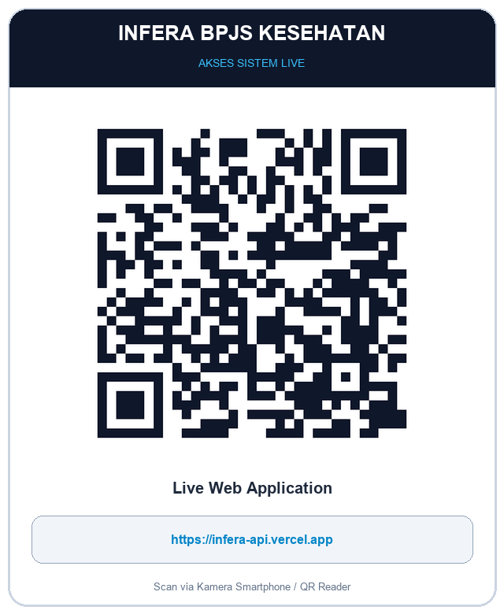
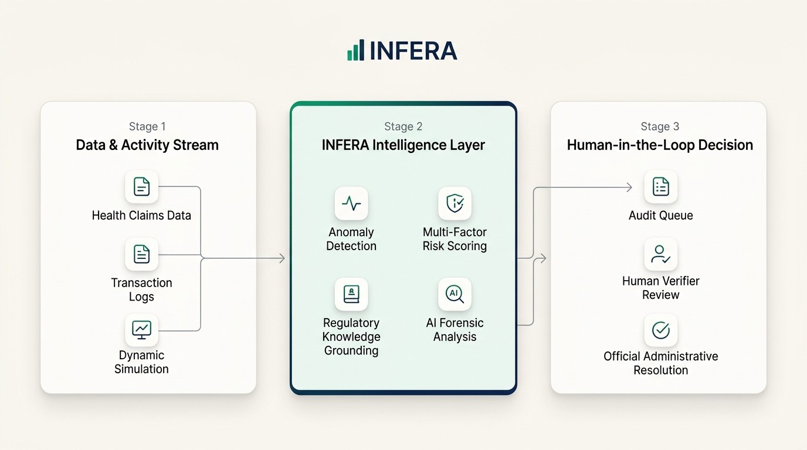
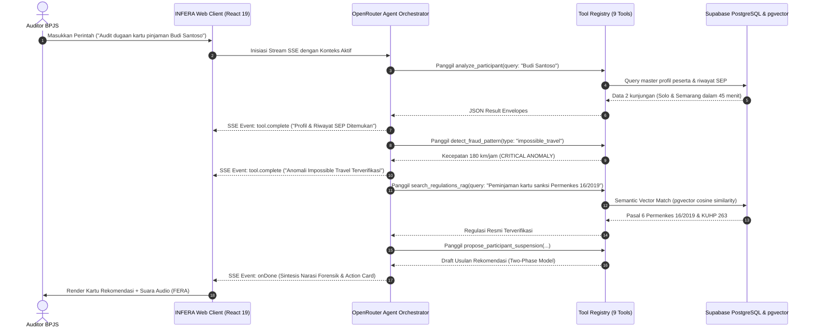

<div align="center">

<picture>
  <source media="(prefers-color-scheme: dark)" srcset="docs/assets/logo-dark.png">
  
</picture>

# INFERA
### Intelligent Fraud & Risk Analysis Agent
**Enterprise Decision Support System & Autonomous Investigation Agent for BPJS Kesehatan**  
*HealthKathon BPJS Kesehatan 2026 — Kategori Inovasi: Efisiensi Risiko pada Peserta*

<br/>

**Tim Pengembang: MAMAH, AKU IKUT HEALTHKATHON**  
**Arief Fajar** &nbsp;•&nbsp; **Clarisa Nathania Christie** &nbsp;•&nbsp; **Diana Aliffa Puteri**

<br/>

[](https://bpjs-kesehatan.go.id/)
[](https://infera-api.vercel.app)
[](https://github.com/agissugandi7203-ops/INFERA)
[](https://github.com/agissugandi7203-ops/INFERA)
[](https://bpjs-kesehatan.go.id/)

<br/>

[](https://react.dev/)
[](https://www.typescriptlang.org/)
[](https://tailwindcss.com/)
[](https://expressjs.com/)
[](https://supabase.com/)
[](https://openrouter.ai/)
[](https://elevenlabs.io/)
[](http://localhost:4000/docs)
[](https://turbo.build/)

<br/>

<pre align="center">
 ██╗███╗   ██╗███████╗███████╗██████╗  █████╗ 
 ██║████╗  ██║██╔════╝██╔════╝██╔══██╗██╔══██╗
 ██║██╔██╗ ██║█████╗  █████╗  ██████╔╝███████║
 ██║██║╚██╗██║██╔══╝  ██╔══╝  ██╔══██╗██╔══██║
 ██║██║ ╚████║██║     ███████╗██║  ██║██║  ██║
 ╚═╝╚═╝  ╚═══╝╚═╝     ╚══════╝╚═╝  ╚═╝╚═╝  ╚═╝
       Intelligent Fraud & Risk Analysis Agent
</pre>

### Tagline
### *“See the Pattern. Understand the Risk. Act Smarter.”*

<p align="center">
<b>Brand Statement:</b><br/>
<i>“INFERA watches the data, understands the pattern, explains the risk, and helps you decide what to investigate next.”</i>
</p>

<p align="center">
<b>One-Line Product Description:</b><br/>
<i>INFERA adalah AI Agent proaktif yang mengubah data JKN menjadi deteksi pola, risk intelligence, dan rekomendasi investigasi dalam satu dashboard interaktif.</i>
</p>

---

<p align="center" style="max-width: 850px; margin: auto;">
<i>INFERA merupakan solusi berbasis Artificial Intelligence (AI) yang dirancang sebagai asisten virtual untuk membantu proses identifikasi dan analisis potensi risiko dalam penyelenggaraan Program Jaminan Kesehatan Nasional (JKN). INFERA berfokus pada pemanfaatan data aktivitas dan log sistem untuk mengidentifikasi pola, ketidaksesuaian, serta indikator yang memerlukan perhatian lebih lanjut. Pada tahap pengembangan dan simulasi, sistem menggunakan data dummy sebagai pengganti data operasional asli sehingga proses pengujian dapat dilakukan tanpa menggunakan data peserta yang bersifat sensitif.</i>
</p>

<br/>

### 🌐 Akses Cepat & Tautan Demo Sistem

| 🚀 Live Web Application (Vercel) | 📦 Source Code Repository (GitHub) |
| :---: | :---: |
| <a href="https://infera-api.vercel.app"></a><br/>**[infera-api.vercel.app](https://infera-api.vercel.app)** | <a href="https://github.com/agissugandi7203-ops/INFERA"></a><br/>**[github.com/agissugandi7203-ops/INFERA](https://github.com/agissugandi7203-ops/INFERA)** |
| *Pindai QR code untuk demo di smartphone/tablet* | *Pindai QR code untuk meninjau source code* |

</div>

---

## Daftar Isi

1. [Ringkasan Eksekutif & Value Proposition](#1-ringkasan-eksekutif--value-proposition)
2. [Gambaran Project & Prinsip Simulasi](#2-gambaran-project--prinsip-simulasi)
3. [Cara Kerja & Pipeline INFERA](#3-cara-kerja--pipeline-infera)
4. [Regulatory Intelligence & RAG](#4-regulatory-intelligence--rag)
5. [Taksonomi Modus Fraud & Formulasi Algoritma Deteksi](#5-taksonomi-modus-fraud--formulasi-algoritma-deteksi)
   - [Modus 1: Pemalsuan Data & Identitas (Diskordansi Biologis)](#a-modus-1-pemalsuan-data--identitas-diskordansi-biologis-mutlak)
   - [Modus 2: Peminjaman Kartu Kepesertaan (Impossible Travel)](#b-modus-2-peminjaman-kartu-kepesertaan-impossible-travel-velocity)
   - [Modus 3: Pelayanan Tidak Perlu & Doctor Shopping (DSI)](#c-modus-3-pelayanan-tidak-perlu--doctor-shopping-doctor-shopping-index---dsi)
   - [Modus 4: Penyalahgunaan Obat PRB & Alat Kesehatan (POR & Cooling-off)](#d-modus-4-penyalahgunaan-obat-kronis-prb--masa-tunggu-alat-kesehatan-por--cooling-off)
   - [Matriks Scoring Risiko Multi-Faktor & Rule Override](#e-matriks-scoring-risiko-multi-faktor--rule-override)
6. [Arsitektur Agen AI Forensik & Orchestrator Tools](#6-arsitektur-agen-ai-forensik--orchestrator-tools)
   - [Alur Kerja SSE (Server-Sent Events)](#a-alur-kerja-sse-server-sent-events)
   - [Katalog 9 Forensic Investigation Tools](#b-katalog-9-forensic-investigation-tools)
   - [Strict Two-Way Human-in-the-Loop Governance](#c-strict-two-way-human-in-the-loop-governance)
   - [Matriks Hak Akses Berjenjang (RBAC Matrix)](#d-matriks-hak-akses-berjenjang-rbac-matrix)
7. [4 Kasus Forensik Benchmark Terverifikasi](#7-4-kasus-forensik-benchmark-terverifikasi)
8. [Komponen Dashboard & Fitur Unggulan](#8-komponen-dashboard--fitur-unggulan)
   - [Live Risk Monitoring & Simulation Monitor](#a-live-risk-monitoring--simulation-monitor)
   - [Interactive AI Multimodal Voice & Avatar Engine (FERA & Luna)](#b-interactive-ai-multimodal-voice--avatar-engine-fera--luna)
   - [Real-Time Live Claim Stream Simulation Engine](#c-real-time-live-claim-stream-simulation-engine)
   - [Enterprise SaaS UI dengan Dark & Light Mode Persistence](#d-enterprise-saas-ui-dengan-dark--light-mode-persistence)
9. [Positioning, Nilai Utama & Tujuan Project](#9-positioning-nilai-utama--tujuan-project)
10. [Arsitektur Monorepo & Struktur Direktori](#10-arsitektur-monorepo--struktur-direktori)
11. [Konfigurasi Lingkungan & Variabel (.env)](#11-konfigurasi-lingkungan--variabel-env)
12. [Panduan Instalasi & Menjalankan Lokal](#12-panduan-instalasi--menjalankan-lokal)
13. [Dokumentasi Interaktif API (Swagger / OpenAPI 3.0)](#13-dokumentasi-interaktif-api-swagger--openapi-30)
14. [Panduan Deployment Produksi](#14-panduan-deployment-produksi)
    - [Deployment Frontend di Vercel](#a-deployment-frontend-di-vercel)
    - [Deployment Backend API di Railway](#b-deployment-backend-api-di-railway)
    - [Migrasi Supabase Database & pgvector RAG](#c-migrasi-supabase-database--pgvector-rag)
15. [Kepatuhan Regulasi & Landasan Hukum JKN](#15-kepatuhan-regulasi--landasan-hukum-jkn)
16. [Tim Pengembang, Hak Cipta & Lisensi](#16-tim-pengembang-hak-cipta--lisensi)

---

## 1. Ringkasan Eksekutif & Value Proposition

**INFERA (Intelligent Fraud & Risk Analysis Agent)** hadir sebagai asisten intelijen dan sistem pendukung keputusan (*Decision Support System*) berbasis kecerdasan buatan (*Artificial Intelligence*) untuk memperkuat integritas penyelenggaraan Program Jaminan Kesehatan Nasional (JKN) di bawah kelolaan BPJS Kesehatan. Fokus utama INFERA tertuju pada identifikasi dini serta analisis anomali perilaku risiko peserta secara komprehensif melalui pemrosesan log sistem dan aliran aktivitas pelayanan kesehatan secara *real-time*.

Dalam rangka pengujian dan validasi teknologi yang etis serta mematuhi **UU Pelindungan Data Pribadi (UU PDP No. 27/2022)**, seluruh proses simulasi INFERA memanfaatkan data sintetis (*dynamic dummy data*) yang dirancang mencerminkan ekosistem pelayanan JKN sesungguhnya tanpa menyentuh data riil peserta yang bersifat privat.

### Pendekatan Solutif: Sinergi AI Agent & RAG Terintegrasi
INFERA menjembatani kesenjangan antara sistem pemantauan konvensional yang kaku (*static rule-based*) dengan dinamika transaksi di lapangan:
1. **Analisis Agen Mandiri (*Autonomous AI Agent*):** Bekerja proaktif mengurai anomali log klaim, menguji hipotesis kecurangan menggunakan kalkulasi matematika deterministik, dan menjalankan investigasi terpandu.
2. **Regulatory Grounding via RAG (*Retrieval-Augmented Generation*):** Setiap temuan anomali secara otomatis dicocokkan dengan basis pengetahuan regulasi resmi JKN (UU No. 40/2004, UU No. 24/2011, Permenkes No. 16/2019, Permenkes No. 3/2023, hingga KUHP), sehingga setiap rekomendasi audit memiliki rujukan hukum positif yang transparan dan dapat dipertanggungjawabkan (*auditable & explainable*).
3. **Indeks Keraguan Terukur (*Multi-Factor Risk Score*):** Menghasilkan skor risiko berskala 0–100 untuk membantu tim verifikator memetakan skala prioritas telaah klaim secara objektif.

> [!IMPORTANT]
> **Prinsip Human-in-the-Loop & Larangan Vonis Otonom:**  
> INFERA memegang teguh etika kecerdasan buatan di mana AI **tidak pernah menjatuhkan sanksi atau membatalkan status peserta secara sepihak**. Sistem bertindak murni sebagai *investigative copilot* yang menyusun bukti, menguraikan kronologi, dan memberikan usulan rekomendasi berjenjang. Otoritas penegakan sanksi administratif, pemanggilan verifikasi, maupun eskalasi hukum tetap berada 100% di bawah kendali auditor dan pejabat berwenang manusia.

### Interaksi Multimodal & Suara Alami
Guna mempercepat adopsi dan kemudahan penelaahan, INFERA dilengkapi dengan asisten virtual berwujud avatar interaktif yang didukung sintesis suara neural alami (*low-latency neural TTS*). Auditor dapat berdialog secara langsung menggunakan bahasa percakapan sehari-hari untuk menggali latar belakang kasus, memeriksa alasan penandaan anomali, hingga meminta ringkasan pasal hukum yang relevan.

<p align="center">
  
</p>

Diagram di atas mengilustrasikan tiga lapisan arsitektur terpadu INFERA:
- **Tahap 1 (Data & Aktivitas):** Transaksi pelayanan, penerbitan SEP, rujukan, dan resep diproses secara kontinu melalui *Simulation Engine* untuk memodelkan dinamika risiko kepesertaan secara dinamis.
- **Tahap 2 (Lapisan Intelligence INFERA):** Mesin analitik melakukan deteksi pola, menghitung skor risiko multi-faktor, memvalidasi bukti terhadap korpus regulasi via RAG, dan mengorkestrasi 9 *forensic tools*.
- **Tahap 3 (Keputusan Manusia - HITL):** Hasil investigasi dirangkum ke dalam antrean prioritas kasus bagi auditor manusia untuk ditelaah dan diputuskan sebelum eksekusi administratif perlindungan Dana Jaminan Sosial (DJS).

---

## 2. Gambaran Project & Prinsip Simulasi

INFERA dikembangkan dalam bentuk **platform simulasi berbasis web** yang merepresentasikan bagaimana sistem analisis risiko dapat bekerja pada lingkungan JKN.

Karena penggunaan data peserta JKN riil memerlukan izin resmi dan tunduk pada UU Pelindungan Data Pribadi (UU PDP No. 27/2022), prototype INFERA menggunakan **data simulasi/dummy** yang dibuat menyerupai pola aktivitas dalam ekosistem JKN. Data tersebut terus bertumbuh secara dinamis melalui **Simulation Engine**, sehingga pengguna dapat melihat bagaimana suatu pola berkembang dari kondisi normal menjadi anomali dan kemudian menjadi kasus yang perlu diinvestigasi.

Dalam simulasi tersebut, sistem dapat menghasilkan berbagai profil peserta, aktivitas pelayanan, riwayat penggunaan fasilitas kesehatan (FKTP dan FKRTL), perubahan kondisi kepesertaan, serta kejadian lain secara temporal. Dari data tersebut, INFERA menganalisis hubungan antaraktivitas untuk menemukan pola yang tidak biasa tanpa membocorkan privasi data riil.

---

## 3. Cara Kerja & Pipeline INFERA

INFERA bekerja melalui siklus 6 tahapan terpadu:

$$\textbf{Data Simulation} \longrightarrow \textbf{Pattern Analysis} \longrightarrow \textbf{Anomaly Detection} \longrightarrow \textbf{Risk Scoring} \longrightarrow \textbf{AI Investigation} \longrightarrow \textbf{Recommendation}$$

### 1. Simulation Engine
Sistem menghasilkan data peserta dan aktivitas secara sintetis berdasarkan berbagai kondisi dan skenario yang telah ditentukan. Data terus bertambah dari waktu ke waktu untuk menciptakan lingkungan simulasi yang dinamis:
- Peserta baru muncul dalam sistem kepesertaan.
- Aktivitas pelayanan bertambah secara temporal.
- Peserta menggunakan fasilitas kesehatan primer maupun rujukan lanjutan.
- Terjadi perubahan frekuensi penggunaan layanan kesehatan.
- Muncul pola aktivitas yang menyimpang dari kurva normal.

Dengan demikian, penguji dan juri tidak hanya melihat data statis, tetapi dapat menyaksikan secara langsung bagaimana risiko berkembang seiring bertambahnya aliran data.

### 2. Pattern & Anomaly Detection
INFERA menganalisis data untuk mencari pola yang menyimpang dari kondisi wajar:
- Lonjakan utilisasi layanan medis dalam interval waktu singkat (*utilization spikes*).
- Perpindahan fasilitas kesehatan yang tidak wajar atau melanggar hukum fisika (*provider switching & impossible travel*).
- Frekuensi kunjungan yang meningkat secara signifikan pada diagnosis sejenis (*doctor shopping*).
- Pola penebusan obat kronis berulang sebelum siklus habis (*prescription overlap*).
- Kombinasi beberapa kejadian yang secara individual terlihat normal tetapi menjadi tidak wajar ketika dihubungkan.

INFERA tidak langsung menyatakan bahwa seseorang melakukan kecurangan; sistem mengidentifikasi **indikator risiko dan anomali yang membutuhkan pemeriksaan lebih lanjut**.

### 3. Risk Scoring (Indeks Keraguan)
Setiap indikator memiliki bobot kontribusi terhadap *Risk Score* (0–100):
- **LOW (0–39):** Pemanfaatan layanan wajar dan selaras pedoman klinis.
- **MEDIUM (40–69):** Terdeteksi deviasi minor; disarankan pemantauan berkala.
- **HIGH (70–84):** Deviasi signifikan multi-indikator; masuk antrean investigasi prioritas.
- **CRITICAL (85–100):** Indikasi anomali berat terkonfirmasi (contoh: *impossible travel* lintas pulau atau diskordansi biologis paten).

> **Contoh Kalkulasi Kasus Nyata:**  
> **Risk Score: 88 — CRITICAL (Kasus Doctor Shopping Hendra Wijaya)**  
> *Indikator Terkorelasi:* Kunjungan Redundan Multi-Faskes ($DSI = 1.00$) + Duplikasi Peresepan Simptomatis + Rujukan Berulang Tanpa Urgensi Klinis.  
> Skor risiko digunakan sebagai instrumen objektif penentuan **skala prioritas audit lapangan**, bukan sebagai vonis final otomatis.

### 4. Proactive AI Agent
Inilah keunggulan utama INFERA. AI tidak hanya bersifat pasif menunggu pertanyaan pengguna. Ketika sistem mendeteksi lonjakan anomali kritis, INFERA secara otomatis memberikan *early warning* kepada administrator:
> *“Terdeteksi peningkatan anomali pada pola utilisasi dalam 30 menit terakhir. Terdapat 14 kasus dengan indikasi doctor shopping dan 3 kasus berisiko kritis yang memerlukan verifikasi berkas SEP.”*

### 5. AI Virtual Assistant (Avatar Multimodal & Suara)
INFERA menghadirkan asisten virtual interaktif berupa avatar digital dengan sinkronisasi bibir (*lip-sync*), ekspresi emosi (*happy*, *thinking*, *surprised*, *confused*, *normal*), dan suara neural alami (ElevenLabs profil FERA & Luna). Assistant berfungsi sebagai antarmuka percakapan natural untuk mengakses data intelligence:
- *“Mengapa kasus ini memiliki skor risiko tinggi?”*
- *“Pola apa yang menyebabkan aktivitas ini ditandai sebagai anomali?”*
- *“Kasus mana yang harus diprioritaskan auditor hari ini?”*
- *“Apa langkah pemeriksaan yang perlu dilakukan menurut Permenkes 16/2019?”*

### 6. AI Tools & Function Calling
Untuk memastikan akurasi tanpa halusinasi (*grounded & deterministic*), AI Agent dilengkapi dengan 9 forensic tools melalui arsitektur function calling:
- **Regulation Search:** Pencarian pasal regulasi resmi JKN melalui RAG semantik.
- **Historical Pattern Analysis:** Komparasi riwayat klaim historis antar-faskes.
- **Case Analysis & Scoring:** Perhitungan deterministik $DSI$, Haversine velocity, dan $POR$.
- **Investigation Report Export:** Pembuatan berkas resume audit forensik resmi.

---

## 4. Regulatory Intelligence & RAG

Salah satu fitur pendukung INFERA adalah kemampuan menghubungkan hasil analisis risiko dengan regulasi atau ketentuan yang berlaku. Setelah menemukan kasus berisiko tinggi, sistem menyajikan alur telaah hukum yang transparan:

$$\textbf{Temuan Bukti} \longrightarrow \textbf{Dasar Regulasi} \longrightarrow \textbf{Interpretasi Yuridis} \longrightarrow \textbf{Rekomendasi Tindakan}$$

Tindakan berjenjang yang direkomendasikan sistem meliputi:
- **Manual Review:** Verifikasi dokumen medis dan kroscek resume medis elektronik (RME).
- **Verification:** Konfirmasi langsung kepada peserta dan dokter penanggung jawab pelayanan (DPJP).
- **Notification:** Pengiriman surat peringatan atau klarifikasi ke fasilitas kesehatan terkait.
- **Escalation:** Rekomendasi suspensi penjaminan sementara atau audit petik lapangan Tim Pencegahan Kecurangan (PK-JKN).

---

## 5. Taksonomi Modus Fraud & Formulasi Algoritma Deteksi

INFERA mengimplementasikan 4 mesin kalkulasi analitik deterministik yang memetakan 4 tipologi modus risiko peserta berdasarkan regulasi resmi Kementerian Kesehatan RI, BPJS Kesehatan, dan Kitab Undang-Undang Hukum Pidana (KUHP):

```
┌───────────────────────────────────────────────────────────────────────────────────────────────────────────┐
│                                     TAKSONOMI 4 MODUS FRAUD INFERA                                        │
├─────────┬──────────────────────────┬──────────────────────────────────────┬─────────────┬─────────────────┤
│ MODUS   │ NAMA TIPOLOGI FRAUD      │ FORMULASI MATEMATIS / ENGINE         │ THRESHOLD   │ DASAR HUKUM     │
├─────────┼──────────────────────────┼──────────────────────────────────────┼─────────────┼─────────────────┤
│ Modus 1 │ Pemalsuan Identitas      │ Absolute Biological Discordance      │ Metric = 1  │ KUHP Ps. 263    │
│ Modus 2 │ Kartu Pinjaman Bersama   │ Impossible Travel Haversine Velocity │ V > 100 km/h│ PMK 16/2019 P.7 │
│ Modus 3 │ Doctor Shopping          │ Doctor Shopping Index (DSI)          │ DSI ≥ 0.50  │ PMK 16/2019 P.7 │
│ Modus 4 │ Resale Obat PRB & Alkes  │ Prescription Overlap Ratio & Cooling │ POR > 140%  │ PMK 3/2023 P.33 │
└─────────┴──────────────────────────┴──────────────────────────────────────┴─────────────┴─────────────────┘
```

---

### A. Modus 1: Pemalsuan Data & Identitas (Diskordansi Biologis Mutlak)

Pemalsuan data kepesertaan atau dokumen klaim terjadi ketika identitas peserta dimanipulasi atau dialihkan kepada individu lain dengan karakteristik biologis yang bertentangan secara fisiologis. Pelanggaran ini merupakan tindak pidana pemalsuan data autentik dan penipuan klaim jaminan kesehatan.

#### Formulasi Diskordansi Biologis Mutlak (*Absolute Biological Discordance*):
Mengevaluasi keselarasan parameter demografi anatomis paten (jenis kelamin terdaftar di database master kepesertaan) terhadap tindakan medis atau diagnosis penyakit organ reproduksi spesifik:

$$\text{Discordance}(\text{Peserta}, \text{SEP}) = 
\begin{cases} 
1, & \text{jika } \text{Gender}(\text{Peserta}) = \text{'L'} \ \land \ \text{Diagnosa} \in \{\text{O00-O99}\} \text{ (Obstetri / Persalinan / Sesar)} \\
1, & \text{jika } \text{Gender}(\text{Peserta}) = \text{'P'} \land \text{Diagnosa} \in \{\text{N40-N51}\} \text{ (Penyakit Organ Genital Pria)} \\
0, & \text{lainnya (Biologis Selaras)}
\end{cases}$$

**Rasional Klinis, Logis & Regulasi:**
- **Kategori ICD-10 `O00-O99` (Bab XV):** Klasifikasi WHO khusus *Pregnancy, childbirth and the puerperium* (misal: Seksio Sesarea `O82.0`, Partus Spontan `O80.0`). Secara anatomi fisiologis biologis, diagnosis dan tindakan ini mutlak hanya dapat dialami oleh individu dengan organ reproduksi rahim wanita.
- **Kategori ICD-10 `N40-N51` (Bab XIV):** Klasifikasi WHO khusus *Diseases of male genital organs*, mencakup hiperplasia prostat jinak (`N40`), prostatitis (`N41`), hingga orchitis/gangguan testis (`N45`). Secara anatomi, organ ini mutlak tidak dimiliki oleh wanita.
- **Mengapa Diberi Skor Deterministik 99/100 (`CRITICAL`)?**  
  Berbeda dengan anomali statistik yang probabilistik, ketidaksesuaian anatomi biologis memiliki probabilitas kesalahan acak mendekati nol ($p \approx 0$). Ketika nilai bernilai $1$, sistem mengabaikan perataan bobot linier (*non-linear deterministic override*) dan langsung memicu status darurat audit guna mencegah klaim fiktif atau peminjaman kartu beda gender sebelum dana DJS ditransfer.
- **Dasar Regulasi & Penegakan Hukum Pidana:**  
  Melanggar **Pasal 263 KUHP** (pemalsuan surat dan penggunaan identitas bukan haknya) dengan ancaman pidana penjara hingga 6 tahun, juncto **Permenkes No. 16 Tahun 2019 Pasal 6 & Pasal 7** tentang kewajiban pengembalian kerugian DJS secara mutlak dalam batas waktu 14 hari kerja.
- **Studi Kasus Rujukan:** Terverifikasi pada **Benchmark Kasus 4: Agus Pratama** (`HK-ID-FALSIFY-2026`), peserta pria yang kartunya digunakan mendaftar operasi sesar di RS Swasta Surabaya (klaim Rp 12.800.000).

---

### B. Modus 2: Peminjaman Kartu Kepesertaan (Impossible Travel Velocity)

Modus peminjaman kartu (*card sharing / pooling*) terjadi saat kartu kepesertaan yang sah diserahkan atau dipinjamkan kepada kerabat atau pihak lain yang tidak terdaftar, sehingga satu nomor kartu dipakai secara serentak di fasilitas kesehatan yang berjauhan. INFERA mendeteksinya melalui analisis kecepatan perpindahan spasial-temporal (*geodesic velocity*).

#### Formulasi Kecepatan Perjalanan Spasial-Temporal (*Impossible Travel Velocity*):
Mendeteksi apakah kartu peserta yang sama diterbitkan Surat Eligibilitas Peserta (SEP) di dua fasilitas kesehatan yang terpisah secara geografis dalam selang waktu transit yang mustahil ditempuh secara fisik:

$$V_{\text{travel}} = \frac{d(\text{lat}_1, \text{lng}_1, \text{lat}_2, \text{lng}_2)}{\Delta t}$$

Jarak lingkaran besar (*great-circle geodesic distance*) dihitung dengan formula **Haversine**:

$$a = \sin^2\left(\frac{\Delta \phi}{2}\right) + \cos(\phi_1)\cos(\phi_2)\sin^2\left(\frac{\Delta \lambda}{2}\right)$$

$$d = 2R \cdot \text{atan2}\left(\sqrt{a}, \sqrt{1-a}\right)$$

**Definisi Variabel & Parameter:**
- $R = 6.371\text{ km}$: Jari-jari volumetrik bumi rata-rata (*volumetric mean radius*) sesuai standar geodesi internasional WGS84 (*World Geodetic System 1984*). Nilai ini menghasilkan deviasi jarak $< 0.3\%$ untuk seluruh wilayah kepulauan Indonesia.
- $\phi_1, \phi_2$: Koordinat lintang (*latitude*) faskes 1 dan faskes 2 yang dikonversi ke radian ($\text{rad} = \text{deg} \times \frac{\pi}{180}$).
- $\Delta \lambda$: Selisih koordinat bujur (*longitude*) faskes 1 dan faskes 2 dalam radian.
- $\Delta t = \frac{|t_2 - t_1|}{3.600.000\text{ ms}}$: Selisih waktu penerbitan SEP antar faskes dalam satuan jam desimal.

**Rasional Logistik, Klinis & Regulasi Penetapan Batasan (Thresholds):**
- **Mengapa $\Delta t \le 2\text{ jam}$?**  
  Berdasarkan Standar Pelayanan Minimal (SPM) Rumah Sakit dan SOP Admisi Pasien BPJS Kesehatan (Permenkes No. 28/2014), siklus pelayanan pasien sejak antrean registrasi, validasi biometrik sidik jari/KTP, asesmen triase awal perawat, konsultasi dokter penanggung jawab pelayanan (DPJP), hingga cetak berkas SEP membutuhkan waktu minimal 30 hingga 60 menit. Apabila pasien baru saja terbit SEP di Faskes A, waktu efektif yang tersisa untuk berpindah secara fisik ke Faskes B menjadi sangat sempit.
- **Mengapa Ambang $V_{\text{travel}} > 100\text{ km/jam}$ dikategorikan `HIGH RISK`?**  
  Kecepatan tempuh rata-rata kendaraan bermotor antarkota di Indonesia via jalan tol/arteri berkisar antara 60 hingga 80 km/jam (Peraturan Pemerintah No. 79/2013 tentang Batas Kecepatan Maksimum Tol 100 km/jam). Kecepatan perpindahan *point-to-point* $> 100\text{ km/jam}$ tanpa jeda waktu parkir dan administrasi ulang adalah anomali logistik yang mengindikasikan kartu fisik/digital dibawa oleh orang yang berbeda.
- **Mengapa Ambang $V_{\text{travel}} > 150\text{ km/jam}$ atau $\Delta t \le 45\text{ menit}$ Lintas Kota dikategorikan `CRITICAL RISK` (Skor 95–100)?**  
  Kecepatan di atas 150 km/jam melampaui kemampuan transportasi darat komersial di Indonesia. Dalam selang waktu $\le 45\text{ menit}$ antarkota, terjadinya penerbitan dua SEP sekaligus membuktikan fenomena **teleportasi fisik yang mustahil**. Ini membuktikan secara konklusif bahwa satu nomor kartu digunakan serentak oleh dua individu berbeda di dua faskes terpisah.
- **Dasar Regulasi & Sanksi Hukum:**  
  Melanggar **Permenkes No. 16 Tahun 2019 Pasal 7 ayat (1) huruf a** juncto **Peraturan BPJS Kesehatan No. 6 Tahun 2020** dan **Pasal 263 KUHP**.
- **Studi Kasus Rujukan:** Terverifikasi pada **Benchmark Kasus 1: Budi Santoso** (`HK-ID-SHARING-2026`), kartu terbit di Solo (08:30 WIB) dan Semarang (09:15 WIB) dalam jeda 45 menit dengan kecepatan implisit $180\text{ km/jam}$ (klaim Rp 8.400.000).

---

### C. Modus 3: Pelayanan Tidak Perlu & Doctor Shopping (Doctor Shopping Index - DSI)

Modus *Doctor Shopping* merugikan keuangan JKN karena peserta mendatangi beberapa dokter atau rumah sakit dalam selang waktu sangat singkat untuk keluhan subjektif yang sama (*frequent flyer*). Tujuannya beragam: meminta pemeriksaan penunjang canggih berulang (CT-Scan, MRI, USG) yang tidak berindikasi medis, atau menimbun obat penenang/analgetik.

#### Formulasi Doctor Shopping Index ($DSI$):

$$DSI = \frac{\sum_{i=1}^{N-1} \mathbb{I}\Big(\Delta t_{(i, i+1)} \le 7\text{ hari} \ \land \ \text{ICD}_{i}^{3\text{char}} = \text{ICD}_{i+1}^{3\text{char}} \ \land \ \text{PPK}_i \ne \text{PPK}_{i+1}\Big)}{N_{\text{total}} - 1}$$

**Keterangan Notasi Matematis:**
- $\mathbb{I}(\dots)$: Operator indikator logika biner Kronecker (bernilai 1 jika seluruh kondisi dalam tanda kurung terpenuhi, bernilai 0 jika tidak).
- $N_{\text{total}}$: Total kunjungan rawat jalan peserta dalam periode observasi 30 hari.
- $(N - 1)$: Jumlah transisi interval waktu antar kunjungan berurutan, sehingga rentang nilai $DSI$ terstandarisasi tepat pada interval tertutup $[0, 1.0]$.

**Rasional Penetapan Parameter & Ambang Batas:**
- **Mengapa Interval Pengamatan $\Delta t_{(i, i+1)} \le 7\text{ hari}$?**  
  Menurut **Peraturan BPJS Kesehatan No. 1 Tahun 2014 tentang Penyelenggaraan Pelayanan Jaminan Kesehatan** dan Panduan Praktik Klinis (PPK) Kemenkes, masa observasi evaluasi respons terapi obat rawat jalan minimal adalah 3 hingga 7 hari sebelum dokter penanggung jawab pelayanan (DPJP) melakukan kontrol ulang. Kunjungan mandiri ke faskes lain sebelum 7 hari tanpa surat rujukan balik resmi adalah deviasi perilaku medis yang melanggar sistem rujukan berjenjang.
- **Mengapa Pencocokan Diagnosis Berbasis 3 Karakter ICD-10 ($\text{ICD}^{3\text{char}}$)?**  
  Pemadanan pada tingkat 3 karakter (kategori blok utama, misal `R42` untuk Dizziness/Vertigo, `M54` untuk Nyeri Punggung) dirancang untuk menutup celah penghindaran (*false negative evasion*). Apabila dokter di RS 1 memberi kode `R42.0` (vertigo perifer) dan dokter di RS 2 memberi kode `R42.9` (vertigo unspecified), sistem tetap mendeteksinya sebagai keluhan klinis yang sama.
- **Mengapa Harus Fasilitas Kesehatan Berbeda ($\text{PPK}_i \ne \text{PPK}_{i+1}$)?**  
  Memastikan kunjungan kontrol berkala yang sah pada dokter yang sama di faskes yang sama (*routine scheduled follow-up*) tidak dianggap sebagai anomali. Anomali hanya dihitung bila peserta berpindah-pindah faskes tanpa rujukan horizontal yang sah.

**Tabel Interpretasi Nilai $DSI$:**

| Nilai $DSI$ | Frekuensi Kunjungan | Tingkat Risiko | Interpretasi Medis & Rekomendasi Tindakan |
| :---: | :---: | :---: | :--- |
| **$< 0.30$** | $< 2$ faskes dalam 30 hari | `LOW` | **Perilaku Wajar:** Konsultasi rujukan normal atau pencarian *second opinion* yang sah. |
| **$0.30 - 0.49$** | $2$ faskes dalam 14 hari | `MEDIUM` | **Perhatian Khusus:** Verifikasi catatan resume medis elektronik (RME) oleh verifikator. |
| **$0.50 - 0.79$** | $\ge 3$ faskes dalam 14 hari | `HIGH` | **Doctor Shopping Terkonfirmasi:** $\ge 50\%$ perpindahan faskes redundan. Terbitkan surat pembinaan dan kunci eligibilitas rujukan spesialis mandiri. |
| **$\ge 0.80$** | $\ge 5$ faskes dalam 10 hari | `CRITICAL` | **Klaim Redundan Masif:** Indikasi penimbunan obat/pemeriksaan radiologi berulang. Bekukan hak rujukan mandiri dan jadwalkan konseling dokter keluarga di FKTP terdaftar. |

---

### D. Modus 4: Penyalahgunaan Obat Kronis PRB & Masa Tunggu Alat Kesehatan (POR & Cooling-off)

Modus ini mengeksploitasi fasilitas penjaminan obat Program Rujuk Balik (PRB) untuk 9 penyakit kronis (Diabetes Melitus, Hipertensi, Asma, PPOK, Jantung, dsb.) serta masa tunggu klaim alat kesehatan bernilai tinggi.

#### 1. Rasio Tumpang Tindih Peresepan Kronis (Prescription Overlap Ratio - $POR$)
Mendeteksi penimbunan obat kronis bernilai tinggi (seperti Insulin Pen analog, Antihipertensi ARB, Statin) yang ditebus di beberapa apotek jejaring sebelum jatah konsumsi periode sebelumnya habis:

$$POR = \frac{\sum_{k=1}^{M} S_k}{T_{\text{siklus}}} \times 100\%$$

Dimana $S_k$ adalah durasi hari suplai obat ke-$k$ yang telah ditebus peserta, dan $T_{\text{siklus}}$ adalah periode siklus penjaminan baku.

**Rasional Medis, Farmakokinetik & Regulasi:**
- **Mengapa $T_{\text{siklus}} = 30\text{ hari}$?**  
  Merupakan batas waktu statutory siklus peresepan Program Rujuk Balik (PRB) berdasarkan **Keputusan Menteri Kesehatan No. HK.01.07/MENKES/6477/2021** dan Petunjuk Teknis PRB BPJS Kesehatan. Resep PRB hanya boleh diresepkan untuk kebutuhan konsumsi stabil maksimal 30 hari kalender.
- **Mengapa Disediakan Batas Fleksibilitas Wajar ($100\% - 130\%$ / hingga 39 hari suplai)?**  
  Regulasi BPJS memperbolehkan peserta mengambil obat kronis 3 hingga 5 hari sebelum obat sebelumnya habis guna mengantisipasi hari libur apotek atau kendala logistik pasien. Oleh karena itu, $POR$ hingga $130\%$ dianggap variansi klinis yang sah (*legitimate therapy buffer*).
- **Mengapa $POR > 140\%$ Menjadi Ambang `HIGH RISK`?**  
  Akumulasi obat melampaui 42 hari konsumsi dalam jendela 30 hari tanpa disertai surat instruksi penyesuaian dosis (*dose titration*) tertulis dari dokter spesialis.
- **Mengapa $POR \ge 200\% - 300\%$ Menjadi Bukti Konklusif Resale Arbitrage (`CRITICAL`)?**  
  *Justifikasi Toksikologi Klinis:* Mengonsumsi obat diabetes (Insulin Glargine / Metformin) atau obat antihipertensi (Amlodipine / Candesartan) sebanyak $2\times$ hingga $3\times$ lipat dari dosis harian akan mengakibatkan **koma hipoglikemia mematikan** atau **syok hipotensi kardiogenik fatal**.  
  Secara medis mustahil obat tersebut diminum sendiri oleh pasien. Fenomena penebusan 90 hari suplai dalam 22 hari ($POR = 300\%$) membuktikan secara ilmiah bahwa obat tersebut ditimbun untuk **diperjualbelikan kembali (*resale arbitrage*) ke apotek/klinik swasta non-BPJS**, menimbulkan kerugian langsung bagi Dana Jaminan Sosial (Permenkes No. 16/2019 Pasal 7).

---

#### 2. Pelanggaran Masa Tunggu Alat Kesehatan (Cooling-off Period $\Delta t_{\text{alkes}}$)
Klaim alat kesehatan memiliki ketentuan masa tunggu retensi penggantian (*replacement cooling-off period*) resmi:

$$\Delta t_{\text{alkes}} = \frac{t_{\text{akhir}} - t_{\text{awal}}}{86.400.000\text{ ms/hari}}$$

Klaim dinyatakan sah hanya jika memenuhi masa tunggu statutory ($\Delta t_{\text{alkes}} \ge \tau_{\text{regulasi}}$):

$$\text{Validasi}(\text{Alkes}) = 
\begin{cases} 
\text{Tolak Pra-Bayar (Pre-Payment Denial)}, & \text{jika } \Delta t_{\text{alkes}} < \tau_{\text{regulasi}} \\
\text{Setujui Verifikasi Administrasi}, & \text{jika } \Delta t_{\text{alkes}} \ge \tau_{\text{regulasi}}
\end{cases}$$

**Tabel Masa Tunggu Statutory Sesuai Regulasi Resmi Kemenkes RI:**

| Jenis Alat Kesehatan | Masa Tunggu ($\tau_{\text{regulasi}}$) | Dasar Regulasi Resmi | Ketentuan Klinis & Syarat Klaim |
| :--- | :---: | :--- | :--- |
| **Kacamata Koreksi** | **$730\text{ hari}$ (2 Tahun)** | **Permenkes No. 3/2023 Ps. 33 ayat (1)** | Minimal sferis 0.5 Dioptri atau silindris 0.25 Dioptri, resep dari dokter spesialis mata. |
| **Kursi Roda** | **$1.825\text{ hari}$ (5 Tahun)** | **Permenkes No. 3/2023 Ps. 35 ayat (1)** | Diberikan bagi peserta dengan disabilitas motorik berat menetap/permanen. |
| **Alat Bantu Dengar** | **$1.825\text{ hari}$ (5 Tahun)** | **Permenkes No. 3/2023 Ps. 34 ayat (1)** | Dibatasi maksimal 1x per 5 tahun per telinga atas rekomendasi dokter THT. |
| **Protesa Gigi (Tiruan)** | **$730\text{ hari}$ (2 Tahun)** | **Permenkes No. 3/2023 Ps. 36 ayat (1)** | Diberikan paling cepat 2 tahun sekali untuk rahang yang sama. |
| **Korset Tulang Belakang** | **$730\text{ hari}$ (2 Tahun)** | **Permenkes No. 3/2023 Ps. 37 ayat (1)** | Rekomendasi dokter spesialis bedah ortopedi/saraf. |
| **Collar Leher / Kruk** | **$730\text{ hari}$ (2 Tahun)** | **Permenkes No. 3/2023 Ps. 37 ayat (2)** | Trauma servikal atau pemulihan fraktur pasca operasi. |

Klaim yang diajukan sebelum $\tau_{\text{regulasi}}$ terpenuhi secara otomatis dibatalkan pada lapisan pra-bayar (*pre-payment denial*) dengan kode kesalahan `ERR_COOLING_OFF_ACTIVE`.

---

### E. Matriks Scoring Risiko Multi-Faktor & Rule Override

Untuk menghasilkan nilai risiko yang objektif, transparan, dan dapat dipertanggungjawabkan, INFERA menggabungkan **model pembobotan aktuaria linier (*convex combination*)** dengan **mekanisme pemutus darurat deterministik (*deterministic safety override*)**:

#### 1. Formulasi Skor Komposit Linier ($S_{\text{composite}}$):

$$S_{\text{composite}} = \sum_{m=1}^{4} w_m \cdot s_m + \beta_{\text{riwayat}}$$

Dengan konstrain normalisasi bobot ketat:

$$\sum_{m=1}^{4} w_m = 1.00 \quad (w_m > 0)$$

#### 2. Formulasi Skor Risiko Final ($S_{\text{final}}$):

$$S_{\text{final}} = 
\begin{cases} 
\max\left(S_{\text{composite}}, S_{\text{override}}\right), & \text{jika } \text{Flag}_{\text{deterministik}} = 1 \\
\min\left(100, S_{\text{composite}}\right), & \text{jika anomali probabilistik biasa}
\end{cases}$$

**Tabel Bobot Aktuaria & Rasional Penetapan Bobot:**

| Komponen Risiko | Bobot ($w_m$) | Parameter Evaluasi Matematis | Rasional Aktuaria & Yuridis (Mengapa Bobot Ini?) |
| :--- | :---: | :--- | :--- |
| **Penyalahgunaan Identitas & Spasial** | **$0.35$ (35%)** | $V_{\text{travel}}$, jarak Haversine, duplikasi NIK | Bobot tertinggi karena melibatkan delik pidana pemalsuan (KUHP 263) dan potensi kerugian DJS per klaim sangat besar (tarif rawat inap). |
| **Diskordansi Biologis Demografi** | **$0.30$ (30%)** | Gender vs ICD-10 obstetri / organ reproduksi | Kepastian bukti fisik mutlak ($p \approx 0$). Membuktikan fraud data atau kartu dipinjamkan ke pihak berlainan jenis. |
| **Doctor Shopping & Redundansi** | **$0.20$ (20%)** | Indeks DSI, rasio kunjungan poli $\Delta t \le 7\text{ hari}$ | Menilai inefisiensi operasional rawat jalan. Diberi porsi 20% untuk mengakomodasi sebagian kecil pasien yang memang membutuhkan konsultasi lanjutan. |
| **Penyalahgunaan Farmasi & Alkes** | **$0.15$ (15%)** | Rasio $POR$ obat PRB, masa tunggu $\Delta t_{\text{alkes}}$ | Menilai deviasi kuota obat kronis dan masa tunggu alkes untuk mencegah penimbunan dan klaim prematur. |

- **Parameter Penambah Riwayat ($\beta_{\text{riwayat}} \in [0, 10]$):** Penalti tambahan apabila data riwayat audit menunjukkan peserta pernah menerima surat teguran resmi atau catatan verifikasi dalam 12 bulan terakhir.
- **Nilai Override Deterministik ($S_{\text{override}} \ge 95$):** Menjamin bahwa jika terjadi diskordansi biologis mutlak atau *impossible travel* $> 150\text{ km/jam}$, skor risiko peserta **langsung melompat ke level CRITICAL**, tanpa tereduksi oleh komponen lain yang bernilai 0.

#### 3. Matriks Tingkat Risiko & Tata Kelola Tindakan Administratif:

```
┌────────────────────────────────────────────────────────────────────────────────────────────────────────┐
│                              MATRIKS 4 LEVEL RISIKO & AKSI ADMINISTRATIF                               │
├────────────┬─────────────┬────────────────────────────────────┬────────────────────────────────────────┤
│ SKOR TOTAL │ TINGKAT     │ DEFINISI AKTUAL                    │ REKOMENDASI TINDAKAN & TATA KELOLA     │
├────────────┼─────────────┼────────────────────────────────────┼────────────────────────────────────────┤
│ 0 - 39     │ LOW         │ Pemanfaatan layanan wajar & sah    │ Fast-Track Payment / Klaim Bersih      │
│ 40 - 69    │ MEDIUM      │ Deviasi pola minor / perlu pantau  │ Verifikasi Administrasi Dokumen RME    │
│ 70 - 84    │ HIGH        │ Anomali multi-faktor terindikasi   │ Surat Peringatan & Kunci Rujukan Mandiri│
│ 85 - 100   │ CRITICAL    │ Pelanggaran berat terkonfirmasi    │ Suspensi Sementara & Audit Investigasi │
└────────────┴─────────────┴────────────────────────────────────┴────────────────────────────────────────┘
```

- **Level LOW (0–39):** Tidak ditemukan indikasi kecurangan. Berkas klaim diteruskan melalui jalur cepat (*fast-track pre-settlement*) tanpa hambatan administratif.
- **Level MEDIUM (40–69):** Ditemukan indikator non-kritis (misal: $POR = 115\%$ atau kunjungan 2 faskes tanpa indikasi gawat darurat). Tindakan: pencatatan dalam antrean pemantauan berkala dan pengambilan sampel acak (*random audit sample*).
- **Level HIGH (70–84):** Pola anomali signifikan teridentifikasi (misal: $DSI \ge 0.50$ atau $V_{\text{travel}} > 100\text{ km/jam}$). Tindakan: penerbitan Surat Peringatan (SP-1), penguncian eligibilitas rujukan spesialis mandiri, dan kewajiban konseling dokter keluarga di FKTP terdaftar.
- **Level CRITICAL (85–100):** Bukti kecurangan deterministik terkonfirmasi (Diskordansi Biologis, Impossible Travel lintas kota dalam 45 menit, atau $POR \ge 200\%$). Tindakan: **Penangguhan sementara penjaminan kartu (*temporary eligibility freeze*)**, penolakan pembayaran klaim pra-bayar, dan penerbitan berkas investigasi lapangan oleh Tim Pencegahan Kecurangan JKN (PK-JKN).

---

## 6. Arsitektur Agen AI Forensik & Orchestrator Tools

Inti inovasi teknologi INFERA adalah **Autonomous Investigation Agent** yang dijalankan oleh mesin orchestrator berbasis OpenRouter multi-LLM (`openai/gpt-oss-120b:nitro`, `google/gemini-2.0-flash-001`, `meta-llama/llama-3.3-70b-instruct`) dengan mekanisme *Tool / Function Calling*.

### A. Alur Kerja SSE (Server-Sent Events)

Agen berkomunikasi dengan frontend melalui streaming Server-Sent Events (SSE) yang menampilkan pemanggilan tool (*tool invocation*), status evaluasi, dan penyusunan rekomendasi secara transparan dan terukur:



---

### B. Katalog 9 Forensic Investigation Tools

INFERA dilengkapi dengan 9 tools forensik deterministik yang terdaftar dalam `apps/web/src/features/dashboard/services/tools/toolRegistry.ts`:

| No | Nama Tool | Kategori | Deskripsi Fungsi | Parameter Kunci |
| :---: | :--- | :---: | :--- | :--- |
| **1** | `get_participant_profile` / `analyze_participant` | Read | Menarik data demografi, NIK tersamar, faskes FKTP terdaftar, dan riwayat iuran dari master data. | `participant_query`, `include_encounters` |
| **2** | `get_claim_history` | Read | Mengambil rekam jejak kronologis SEP faskes, diagnosa ICD-10, prosedur ICD-9-CM, dan tarif INA-CBG. | `participant_id` |
| **3** | `run_fraud_indicators` / `detect_fraud_pattern` | Analysis | Menjalankan formula matematika analitik: Impossible Travel, Doctor Shopping DSI, PRB Resale, atau Diskordansi Biologis. | `pattern_type`, `target_id` |
| **4** | `compute_fraud_risk_score` / `calculate_risk_score` | Analysis | Menghitung akumulasi skor risiko fraud (0 - 100) dan mengklasifikasikan tingkat keparahan risiko. | `target_id` |
| **5** | `search_regulations` / `search_regulations_rag` | Legal RAG | Menelusuri pasal regulasi resmi JKN melalui pencarian semantik vektor (UU 40/2004, Permenkes 16/2019, KUHP 263). | `query`, `category` |
| **6** | `get_faskes_profile` | Verification | Memvalidasi kredensial faskes penyelenggara, kelas RS, kepatuhan klaim, dan histori penolakan berkas. | `ppk_code` |
| **7** | `trigger_action_recommendation` | Governance | Mengajukan usulan tindakan berjenjang (audit lapangan, verifikasi biometrik, penangguhan sementara, surat klarifikasi). | `action_type`, `target_id`, `severity`, `legal_basis` |
| **8** | `calculate_financial_loss` | Actuarial | Mengalkulasi total potensi kerugian finansial Dana Jaminan Sosial (DJS) secara presisi. | `target_id`, `include_projected` |
| **9** | `export_audit_report` / `propose_case_review` | Reporting | Menyusun berkas berita acara hasil pemeriksaan forensik terstruktur dan pintasan rute investigasi. | `case_id`, `patient_name`, `target_workflow_route` |

---

### C. Strict Two-Way Human-in-the-Loop Governance

Salah satu pilar etika AI terpenting dalam INFERA adalah **larangan eksekusi tindakan administratif secara sepihak oleh model AI**.

```
   ┌─────────────────────────────────────────────────────────────┐
   │                   FASE 1: REKOMENDASI AI                    │
   │  AI memproses bukti forensik, menghitung skor risiko,       │
   │  mengutip regulasi hukum, dan MEMBUAT DRAFT USULAN TINDAKAN.│
   └──────────────────────────────┬──────────────────────────────┘
                                  │
                                  ▼
   ┌─────────────────────────────────────────────────────────────┐
   │             FASE 2: HUMAN OVERSIGHT & KONFIRMASI            │
   │  Auditor manusia meninjau bukti pada ActionConfirmationModal│
   │  Memberikan catatan pertimbangan & membubuhkan persetujuan. │
   └──────────────────────────────┬──────────────────────────────┘
                                  │
                                  ▼
   ┌─────────────────────────────────────────────────────────────┐
   │                   EKSEKUSI ADMINISTRATIF                    │
   │  Tindakan (Penangguhan Kartu / Surat Panggilan / Audit)     │
   │  dieksekusi resmi ke sistem BPJS dengan jejak audit sah.    │
   └─────────────────────────────────────────────────────────────┘
```

#### Komponen Otorisasi `ActionConfirmationModal.tsx`:
- **Peringatan Tingkat Keparahan:** Visual header merah marun untuk level `CRITICAL` (Suspensi) dan oranye amber untuk level `HIGH` (Peringatan).
- **Checklist Kepatuhan Hukum:** Auditor wajib mencentang klausul persetujuan kepatuhan regulasi sebelum tombol eksekusi aktif.
- **Catatan Wajib Auditor (*Auditor Notes*):** Setiap persetujuan mewajibkan justifikasi tertulis yang disimpan permanen ke dalam tabel `audit_access_logs` PostgreSQL demi akuntabilitas hukum.

---

### D. Matriks Hak Akses Berjenjang (RBAC Matrix)

Sistem membedakan izin pemanggilan tools berdasarkan peran pengguna (*User Roles*):

| Forensic Tool / Operasi | Tamu Publik (`anon`) | Verifikator Faskes (`analyst`) | Auditor Investigasi (`auditor`) | Direksi / Administrator (`admin`) |
| :--- | :---: | :---: | :---: | :---: |
| `analyze_participant` | `Restricted` | `Authorized` | `Authorized` | `Authorized` |
| `get_claim_history` | `Restricted` | `Authorized` | `Authorized` | `Authorized` |
| `detect_fraud_pattern` | `Restricted` | `Authorized` | `Authorized` | `Authorized` |
| `calculate_risk_score` | `Restricted` | `Authorized` | `Authorized` | `Authorized` |
| `search_regulations_rag` | `Restricted` | `Authorized` | `Authorized` | `Authorized` |
| `propose_case_review` | `Restricted` | `Authorized` | `Authorized` | `Authorized` |
| `propose_warning_letter` | `Restricted` | `Restricted` | **`Authorized`** | **`Full Authority`** |
| `propose_participant_suspension` | `Restricted` | `Restricted` | **`Authorized`** | **`Full Authority`** |
| **Eksekusi Pembatalan Klaim/SEP** | `Restricted` | `Restricted` | **`Dual-Approval`** | **`Full Authority`** |

---

## 7. 4 Kasus Forensik Benchmark Terverifikasi

INFERA menyertakan 4 studi kasus benchmark riil yang mencerminkan skenario nyata audit kepesertaan JKN:

| Kode Kasus | Nama Peserta (Masked) | Modus Utama | Skor Risiko | Kerugian DJS | Dasar Hukum Regulasi |
| :---: | :--- | :--- | :---: | :---: | :--- |
| **CASE-001** | Budi Santoso (`3374**********01`) | Peminjaman Kartu (Impossible Travel) | **96/100** | Rp 8.400.000 | Peraturan BPJS No. 6/2020 & KUHP 263 |
| **CASE-002** | Hendra Wijaya (`3273**********88`) | Doctor Shopping (Vertigo Redundan) | **88/100** | Rp 4.200.000 | Permenkes No. 16/2019 & No. 28/2014 |
| **CASE-003** | Nurul Hidayati (`1271**********54`) | Resale Arbitrase Obat Kronis PRB | **94/100** | Rp 6.300.000 | Permenkes No. 16/2019 & Panduan PRB |
| **CASE-004** | Agus Pratama (`3578**********11`) | Diskordansi Biologis Mutlak (Sesar) | **99/100** | Rp 12.800.000 | Permenkes No. 16/2019 Ps. 6 & KUHP 263 |

---

### Uraian Detil Skenario Kasus:

#### 1. Kasus 1: Budi Santoso (`HK-ID-SHARING-2026`)
- **Kronologi Anomali:** Nomor kartu `0001847291038` terbit SEP No. `1114R0010926V0001` di RSUD Dr. Moewardi Surakarta pada pk. 08:30 WIB (Rawat Inap, diagnosa infark miokard akut $I21.0$, tarif Rp 8.400.000). Tepat 45 menit kemudian (pk. 09:15 WIB), terbit SEP kedua No. `1101R0050926V0042` di RS Mitra Husada Semarang (Rawat Jalan, diagnosa low back pain $M54.5$, tarif Rp 320.000).
- **Bukti Forensik:** Jarak kedua faskes adalah 63.5 km hingga 110 km via darat. Kecepatan implisit perjalanan mencapai **$180\text{ km/jam}$**, melampaui batas fisik kewajaran.
- **Rekomendasi AI:** Pembatalan SEP berjalan, penerbitan tagihan ganti rugi Rp 8.400.000, dan penangguhan sementara kepesertaan.

#### 2. Kasus 2: Hendra Wijaya (`HK-DOC-SHOPPING-2026`)
- **Kronologi Anomali:** Peserta mendatangi 5 fasilitas kesehatan berbeda (3 klinik pratama dan 2 RS swasta) di Kota Bandung dalam kurun waktu 10 hari, seluruhnya dengan keluhan pusing/vertigo ringan ($R42$).
- **Bukti Forensik:** Terjadi duplikasi peresepan obat simptomatis dan rujukan pemeriksaan CT-Scan kepala berulang tanpa adanya indikasi kegawatdaruratan neurologis. Nilai **$DSI = 1.00$**.
- **Rekomendasi AI:** Penguncian eligibilitas rujukan spesialis mandiri, audit faskes pemberi rujukan, dan konseling wajib melalui dokter keluarga FKTP.

#### 3. Kasus 3: Nurul Hidayati (`HK-PRB-RESALE-2026`)
- **Kronologi Anomali:** Peserta Program Rujuk Balik (PRB) diabetes melitus tipe 2 menebus Insulin Glargine Pen dan Amlodipine 10mg sebanyak **90 hari pakai hanya dalam tempo 22 hari** melalui 3 apotek jejaring berbeda di Kota Medan.
- **Bukti Forensik:** Rasio tumpang tindih resep $POR = 300\%$ (surplus 190% obat). Terindikasi kuat bahwa surplus obat kronis bermerk ini diperjualbelikan kembali (*resale*) ke pasar bebas.
- **Rekomendasi AI:** Pemblokiran akses penebusan apotek jejaring mandiri, pembatasan jatah obat dengan pengawasan ketat, dan program Pengawasan Minum Obat (PMO) langsung di Puskesmas.

#### 4. Kasus 4: Agus Pratama (`HK-ID-FALSIFY-2026`)
- **Kronologi Anomali:** Kartu peserta BPJS No. `0004928172938` atas nama Agus Pratama, berjenis kelamin **Laki-Laki**, usia 42 tahun, digunakan untuk mendaftar rawat inap tindakan persalinan **Seksio Sesarea (*Delivery by Elective Caesarean Section* - $O82.0$)** di RS Swasta Surabaya dengan klaim Rp 12.800.000.
- **Bukti Forensik:** Diskordansi biologis mutlak ($100\%$ anomali gender). Kartu terbukti dipinjamkan/disewakan kepada pasien wanita non-peserta JKN.
- **Rekomendasi AI:** Penolakan klaim 100%, penerbitan Berita Acara Pelanggaran Pidana (KUHP 263), dan pembebanan biaya perawatan mandiri kepada keluarga pasien.

---

## 8. Komponen Dashboard & Fitur Unggulan

Seluruh proses analisis risiko, deteksi anomali, hingga telaah forensik disajikan dalam satu dashboard terintegrasi yang responsif dan elegan:

### A. 6 Komponen Inti Dashboard Pengawasan:
1. **Live Risk Monitoring:** Menampilkan matriks distribusi tingkat risiko secara real-time dari simulasi aliran data klaim:
   - **LOW:** 1.284 kasus (Pemanfaatan layanan wajar)
   - **MEDIUM:** 182 kasus (Deviasi utilisasi ringan)
   - **HIGH:** 48 kasus (Anomali multi-faskes prioritas tinggi)
   - **CRITICAL:** 12 kasus (Dugaan pelanggaran berat / kartu ganda)
2. **Simulation Monitor:** Menampilkan volume pertumbuhan data secara dinamis dari waktu ke waktu:
   - **Participants Audited:** 12.482 peserta
   - **Service Events (SEP):** 84.321 transaksi layanan
   - **Detected Anomalies:** 243 pola tidak wajar
   - **High Risk Cases:** 48 kasus dalam antrean penanganan
3. **Risk Timeline:** Menampilkan perubahan tingkat risiko secara temporal sehingga pola eskalasi kasus dapat diamati perkembangannya.
4. **Investigation Queue:** Menampilkan antrean kasus yang harus diprioritaskan auditor berdasarkan kombinasi *risk score* dan indikator yang ditemukan.
5. **AI Insight:** Menghasilkan ringkasan otomatis mengenai perubahan tren pola kecurangan yang sedang terjadi dalam sistem.
6. **Virtual Assistant (Avatar & Voice):** Titik interaksi utama antara auditor dengan AI melalui percakapan teks natural maupun perintah suara real-time.

---

### B. Interactive AI Multimodal Voice & Avatar Engine (FERA & Luna)

INFERA menghadirkan asisten avatar visual cerdas yang bertindak sebagai antarmuka interaksi natural antara auditor dengan sistem intelijen risiko. Avatar digerakkan oleh mesin grafis Canvas/WebGL berbasis **PixiJS v8** dan **GSAP** berkinerja tinggi (60 FPS stabil) dengan sinkronisasi artikulasi bibir (*real-time lip-sync*) dan sintesis suara neural alami ElevenLabs.

<div align="center">
  <table>
    <tr>
      <td width="28%" align="center" valign="middle">
        
        <br/>
        <sub><b>Model Karakter Utuh FERA</b><br/><i>Multi-Layer Rigged Mesh 60 FPS</i></sub>
      </td>
      <td width="72%" valign="middle">
        <p align="center">
          
          <br/>
          <sub><b>Ekspresi Wajah Adaptif:</b> Siaga Mendengarkan (Kiri) &bull; Penjelasan &amp; Lip-Sync (Tengah) &bull; Analisis / Berpikir (Kanan)</sub>
        </p>
        <hr/>
        <p align="left">
          <b>Karakteristik Visual &amp; Motorik Asisten:</b><br/>
          &bull; <b>Artikulasi Fonemik Halus:</b> Gerakan bibir terbuka dinamis yang disinkronkan secara matematis dengan amplitudo audio ElevenLabs tanpa jeda latensi.<br/>
          &bull; <b>State Reaction Otomatis:</b> Wajah berubah ke mode berpikir saat mengeksekusi <i>tool calls</i> analitik, dan kembali tersenyum ramah saat menyajikan insight.<br/>
          &bull; <b>Ringan &amp; Responsif:</b> Sprite atlas 2D teroptimasi penuh, bebas beban GPU berlebih, dan terintegrasi mulus sebagai floating widget.
        </p>
      </td>
    </tr>
  </table>
</div>

#### Penjabaran Status Ekspresi Adaptif Avatar:
1. **Siap & Mendengarkan (*Normal / Listening State*):**  
   - **Visual:** Tatapan mata ramah, postur tegak siaga, dan senyuman lembut natural.
   - **Konteks Operasional:** Status default sistem saat menunggu instruksi auditor. Ketika mikrofon diaktifkan, indikator gelombang suara hijau menyala dan avatar masuk ke mode mendengarkan input suara pengguna secara terfokus.
2. **Berbicara & Penjelasan Yuridis (*Speaking / Lip-Sync State*):**  
   - **Visual:** Artikulasi bibir terbuka dinamis yang disinkronkan secara matematis (*audio-driven lip movement*) dengan kontur fonem suara vokal ElevenLabs.
   - **Konteks Operasional:** Aktif ketika asisten membacakan ringkasan hasil audit, menguraikan kronologi anomali klaim, atau mengutip pasal regulasi resmi JKN secara langsung kepada auditor.
3. **Analisis Kasus & Penelaahan Regulasi (*Thinking State*):**  
   - **Visual:** Tatapan mata analitis terfokus disertai bayangan kontemplatif halus pada area dahi.
   - **Konteks Operasional:** Dipicu secara otomatis saat AI Agent mengeksekusi *tool calls* di latar belakang—seperti mengalkulasi formula matematis ($DSI, V_{\text{travel}}, POR$), mengkroscek riwayat kunjungan SEP, atau melakukan pencarian semantik vektor regulasi di Supabase pgvector.

#### Dual Voice Identity & Profil Vokal (ElevenLabs Neural Voice):
- **FERA (Default AI Voice):** Karakter vokal ramah, artikulatif, dan profesional (`GgFtkxszsIQcD4MYvQax`), dirancang untuk memandu auditor dalam eksplorasi dashboard sehari-hari.
- **Luna (Secondary Voice):** Karakter vokal lebih lembut dan tenang (`0csCu4D7iyBsmlVlf9Iu`), dapat dialihkan secara instan melalui menu opsi pada widget avatar.
- **Voice Auditor & Analyst Mode:** Profil vokal formal dengan intonasi tegas (`onwK4e9ZLuTAKqWW03F9`) untuk pembacaan berita acara pemeriksaan forensik resmi.

---

### C. Real-Time Live Claim Stream Simulation Engine

Untuk pengujian tanpa henti (*zero-downtime demonstration*), INFERA dilengkapi mesin simulasi penerbitan klaim otomatis yang terkalibrasi dengan realitas data BPJS Kesehatan:
- **Data Medis Realistis:** Diagnosis ICD-10 nyata, kode tindakan ICD-9-CM, pengelompokan tarif INA-CBG resmi, kelas RS (A, B, C, FKTP), dan jenis perawatan (Ranap vs Ralan).
- **Poisson Arrival Rate:** Aliran klaim dapat diatur kecepatannya (1 klaim/detik hingga 10 klaim/detik) untuk mensimulasikan beban puncak (*peak hour*) kantor cabang BPJS.
- **Preset Injeksi Anomali:** Auditor dapat memicu skenario fraud secara instan (Impossible Travel Solo-Semarang, Overlap PRB, atau Diskordansi Sesar) untuk menguji keandalan deteksi sistem secara *live*.

---

### D. Enterprise SaaS UI dengan Dark & Light Mode Persistence

Antarmuka INFERA dirancang dengan standar desain enterprise modern:
- **Medical Theme Palette:** Palet warna Emerald BPJS, Medical Cyan, Deep Slate, dan Crimson Alert yang ergonomis untuk auditor yang bekerja berjam-jam.
- **Seamless Theme Switching:** Toggle Dark Mode & Light Mode mulus dengan sinkronisasi otomatis ke `localStorage` dan preferensi sistem operasi (`prefers-color-scheme`).
- **Responsive Data Visualizations:** Grafik donat komposisi modus, tren risiko geospasial, dan kartu metrik KPI yang adaptif di berbagai resolusi layar.

---

## 9. Positioning, Nilai Utama & Tujuan Project

### A. Positioning Strategis
> **INFERA bukan sekadar chatbot.**  
> **INFERA bukan sekadar dashboard.**  
> **INFERA bukan sekadar fraud detector.**

INFERA merupakan **lapisan intelligence berbasis AI** yang menghubungkan data aktivitas, analisis risiko, investigasi forensik, regulasi JKN, dan interaksi manusia dalam satu ekosistem:

$$\textbf{DATA} \longrightarrow \textbf{PATTERN} \longrightarrow \textbf{RISK} \longrightarrow \textbf{INSIGHT} \longrightarrow \textbf{ACTION}$$

INFERA mengubah data yang sebelumnya hanya menjadi kumpulan log aktivitas menjadi informasi yang membantu petugas memahami:
- **Apa yang terjadi?** (Identifikasi pola penyimpangan).
- **Mengapa hal tersebut terjadi?** (Korelasi indikator medis & administratif).
- **Seberapa besar risikonya?** (Kalkulasi skor risiko 0–100 dan potensi kerugian DJS).
- **Apa yang perlu diperiksa selanjutnya?** (Rekomendasi audit berlandaskan regulasi resmi).

---

### B. 4 Nilai Utama INFERA
1. **Proactive:** Sistem tidak menunggu administrator menemukan masalah terlebih dahulu; INFERA secara aktif mengamati perubahan pola dan memberikan *early warning*.
2. **Explainable:** Setiap skor risiko disertai indikator pembentuk, fakta log, dan formula matematis yang dapat diverifikasi (*no black box*).
3. **Actionable:** Output analisis tidak berhenti pada notifikasi anomali semata, melainkan diteruskan menjadi rekomendasi investigasi terstruktur dan penggunaan tools forensik yang relevan.
4. **Human-in-the-Loop:** INFERA membantu petugas menganalisis dan menentukan prioritas audit, bukan menggantikan kewenangan keputusan manusia.

---

### C. Contoh Skenario Simulasi Nyata
Sistem menghasilkan data peserta sintetis dengan profil:
- **Lama Kepesertaan:** 3 tahun.
- **Aktivitas Historis:** Rendah (pemanfaatan wajar di FKTP terdaftar).
- **Aktivitas Periode Berjalan:** Meningkat tajam dalam kurun waktu singkat.

Kemudian terjadi pola rujukan berantai:
$$\text{RS A} \longrightarrow \text{RS B} \longrightarrow \text{RS C} \longrightarrow \text{RS D}$$
dalam selang waktu yang sangat rapat dengan keluhan diagnosis sejenis.

Secara individual, setiap kunjungan rumah sakit terlihat sah. Namun setelah seluruh data dihubungkan lintas faskes, INFERA mendeteksi kombinasi anomali:
$$\textbf{Low Utilization Historis} + \textbf{Sudden Utilization Spike} + \textbf{Provider Switching} + \textbf{Repeated Service Pattern}$$

Sistem mengkalkulasi skor:
$$\textbf{Risk Score: 78 — HIGH}$$

INFERA secara proaktif mengirimkan peringatan ke dashboard auditor:
> *“Terdeteksi peningkatan risiko pada peserta berdasarkan kombinasi lonjakan utilisasi, perpindahan fasilitas kesehatan yang tidak wajar, dan pola layanan berulang. Kasus direkomendasikan untuk investigasi lebih lanjut.”*

Saat auditor menanyakan via suara: *“Kenapa skor risikonya tinggi?”*, asisten virtual menjelaskan rincian indikator tersebut dan menyajikan pintasan audit berkas SEP secara instan.

---

### D. Tujuan Strategis Project
INFERA dirancang untuk mencapai 8 sasaran utama:
1. Mensimulasikan pertumbuhan data dan aktivitas kepesertaan dalam ekosistem JKN secara dinamis.
2. Mengidentifikasi pola penyimpangan dan anomali dari data yang terus mengalir.
3. Menghasilkan skor risiko multi-faktor untuk membantu memprioritaskan kasus audit.
4. Memberikan notifikasi dan *early warning insights* secara proaktif tanpa menunggu laporan manual.
5. Membantu investigasi melalui AI Virtual Assistant berbasis antarmuka teks dan suara natural.
6. Menggunakan 9 AI tools dan *function calling* untuk penelusuran regulasi serta analisis kasus yang akurat.
7. Menyajikan seluruh proses dalam satu dashboard analitik yang intuitif dan transparan.
8. Mendukung proses pengambilan keputusan manusia dengan informasi yang berlandaskan hukum dan dapat dipertanggungjawabkan.

---

## 10. Arsitektur Monorepo & Struktur Direktori

Repository ini menggunakan arsitektur **Turborepo / npm Workspaces** yang memisahkan tanggung jawab kode secara modular (*Strict Boundary Separation*):

```text
infera-monorepo/
├── apps/
│   ├── api/                              # Backend Express & TypeScript Service (Port 4000)
│   │   ├── src/
│   │   │   ├── config/                   # Validasi Zod environment variables (env.ts)
│   │   │   ├── controllers/              # HTTP Request Controllers (AI, Health, Risk, RAG)
│   │   │   │   ├── ai.controller.ts
│   │   │   │   ├── participant-risk.controller.ts
│   │   │   │   └── rag.controller.ts
│   │   │   ├── middleware/               # Auth guard, rate limiter, centralized error handler
│   │   │   ├── routes/                   # Endpoint REST routing (/api/v1/*)
│   │   │   ├── services/                 # Layanan bisnis utama & integrasi vendor
│   │   │   │   ├── openrouter.service.ts # Adapter LLM OpenRouter dengan fallback
│   │   │   │   ├── participant-risk.service.ts # Implementasi algoritma 4 modus fraud
│   │   │   │   ├── rag.service.ts        # Pencarian vektor regulasi JKN
│   │   │   │   └── supabase.service.ts   # Client Supabase dengan fallback sandbox
│   │   │   ├── utils/                    # Standar API Envelope & AppError
│   │   │   ├── app.ts                    # Express application setup & middleware chain
│   │   │   └── server.ts                 # HTTP server bootstrap entrypoint
│   │   ├── package.json
│   │   └── tsconfig.json
│   │
│   └── web/                              # Frontend React 19 / Vite SPA (Port 5173)
│       ├── src/
│       │   ├── components/common/        # UI Primitives (Navbar, Footer, ErrorBoundary)
│       │   ├── context/                  # ThemeContext (Dark/Light mode provider)
│       │   ├── features/
│       │   │   ├── auth/                 # Modal otorisasi login auditor
│       │   │   └── dashboard/            # Modul fungsional dashboard investigasi
│       │   │       ├── avatar/           # PixiJS + GSAP Multimodal Anime Avatar Engine
│       │   │       │   ├── AvatarCanvas.tsx
│       │   │       │   ├── AvatarController.ts
│       │   │       │   └── CharacterModel.ts
│       │   │       ├── components/       # Kartu rekomendasi, ActionConfirmationModal, chat
│       │   │       ├── layout/           # Sidebar navigasi & TopNav profil auditor
│       │   │       ├── pages/            # Halaman rute audit:
│       │   │       │   ├── OverviewPage.tsx          # Ringkasan KPI & feed anomali
│       │   │       │   ├── CasesDeepDivePage.tsx     # 4 Kasus benchmark mendalam
│       │   │       │   ├── IdentityRiskPage.tsx      # Modus 1 & 2 (Peta Spasial)
│       │   │       │   ├── UnnecessaryServicesPage.tsx # Modus 3 (Analisis DSI)
│       │   │       │   ├── PharmacyAlkesPage.tsx     # Modus 4 (Audit PRB & Alkes)
│       │   │       │   ├── RegulationsPage.tsx       # RAG Hukum & Regulasi JKN
│       │   │       │   ├── TransactionsPage.tsx      # Log transaksi klaim & SEP
│       │   │       │   └── MasterDataPage.tsx        # Master data peserta & faskes
│       │   │       ├── services/         # Client-side agent & speech processor
│       │   │       │   ├── openrouterAgent.ts        # SSE Agent & intent planner
│       │   │       │   ├── speech.ts                 # Web Audio & ElevenLabs player
│       │   │       │   ├── tts-processor.ts          # Pemetaan prosodi & viseme emosi
│       │   │       │   └── tools/
│       │   │       │       └── toolRegistry.ts       # Registry 9 Tools Forensik
│       │   │       └── simulation/       # Engine generator simulasi klaim live
│       │   ├── lib/                      # Supabase & Axios client singleton
│       │   ├── routes/                   # Definisi rute React Router DOM v6
│       │   ├── App.tsx                   # Root Application component
│       │   └── main.tsx                  # Vite browser DOM mount
│       ├── package.json
│       └── vite.config.ts
│
├── packages/
│   └── shared/                           # Single Source of Truth Contracts & Types
│       ├── src/
│       │   ├── types.ts                  # Kontrak data peserta, klaim, dan hasil evaluasi
│       │   ├── tool.types.ts             # Definisi JSON Schema Tool Function Calling
│       │   ├── rag.types.ts              # Struktur dokumen regulasi & embedding vector
│       │   ├── simulation.types.ts       # Preset skenario & konfigurasi streaming klaim
│       │   ├── constants.ts              # Kode CBG, tarif standar, dan daftar faskes
│       │   └── index.ts                  # Shared library export gateway
│       ├── package.json
│       └── tsconfig.json
│
├── data/
│   ├── database/
│   │   └── schema_participant_risk.sql   # Skema DDL tabel PostgreSQL peserta & RLS
│   └── regulations/
│       ├── schema_supabase_rag.sql       # Skema tabel pgvector jkn_regulations & RPC
│       └── regulations_chunks.json       # Dataset pasal-pasal regulasi JKN terindeks
│
├── docs/
│   ├── BACKEND_ARCHITECTURE.md           # Spesifikasi teknis backend & pembuktian rumus
│   └── DATABASE_SECURITY.md              # Standar kepatuhan UU PDP & audit trail
│
├── scripts/
│   ├── test_participant_risk.ts          # Script validasi otomatis algoritma 4 modus
│   ├── build_rag_knowledge_base.py       # Pipeline indexing embeddings regulasi JKN
│   └── seed_regulations_rag.py           # Database seeder ke Supabase PostgreSQL
│
├── railway.json                          # Manifest deployment backend pada Railway
├── vercel.json                           # Manifest routing SPA deployment pada Vercel
├── rules.md                              # Standar kode arsitektur Anti-AI Slop
├── .env.example                          # Template konfigurasi variabel lingkungan
└── package.json                          # Monorepo root workspace orchestrator
```

---

## 11. Konfigurasi Lingkungan & Variabel (.env)

Tersedia template konfigurasi di `.env.example`. Buat berkas `.env` pada root project, `apps/api/.env`, dan `apps/web/.env`.

### A. Konfigurasi Backend (`apps/api/.env`)
```bash
# Server Port & Runtime
PORT=4000
NODE_ENV=development

# URL Frontend untuk CORS whitelist
CLIENT_URL=http://localhost:5173

# Supabase Credentials (PostgreSQL & pgvector)
SUPABASE_URL=https://your-project-id.supabase.co
SUPABASE_ANON_KEY=eyJhbGciOiJIUzI1NiIsInR5cCI6IkpXVCJ9...
SUPABASE_SERVICE_ROLE_KEY=eyJhbGciOiJIUzI1NiIsInR5cCI6IkpXVCJ9...

# OpenRouter AI Credentials (LLM Backend Gateway)
OPENROUTER_API_KEY=sk-or-v1-your-openrouter-key
OPENROUTER_DEFAULT_MODEL=openai/gpt-oss-120b:nitro
```

### B. Konfigurasi Frontend Web (`apps/web/.env`)
```bash
# URL Backend API Express
VITE_API_URL=http://localhost:4000/api/v1

# Supabase Client Credentials
VITE_SUPABASE_URL=https://your-project-id.supabase.co
VITE_SUPABASE_ANON_KEY=eyJhbGciOiJIUzI1NiIsInR5cCI6IkpXVCJ9...

# OpenRouter Direct Fallback (Opsional)
VITE_OPENROUTER_API_KEY=sk-or-v1-your-openrouter-key
VITE_DEFAULT_MODEL=openai/gpt-oss-120b:nitro

# ElevenLabs Neural Voice TTS
VITE_ELEVENLABS_API_KEY=your-elevenlabs-api-key
VITE_ELEVENLABS_VOICE_ID=GgFtkxszsIQcD4MYvQax
```

---

## 12. Panduan Instalasi & Menjalankan Lokal

Pastikan komputer Anda telah terpasang **Node.js (versi >= 20.0.0)** dan **npm**.

### Langkah 1: Kloning Repository
```bash
git clone https://github.com/agissugandi7203-ops/INFERA.git
cd INFERA
```

### Langkah 2: Instalasi Seluruh Dependensi Monorepo
Eksekusi instalasi pada root direktori. Npm workspaces akan menginstal dependensi untuk `apps/api`, `apps/web`, dan `packages/shared` sekaligus:
```bash
npm install
```

### Langkah 3: Build Paket Shared
Sebelum menjalankan aplikasi, kompilasi paket kontrak data `@healthathon/shared`:
```bash
npm run build:shared
```

### Langkah 4: Menjalankan Server Pengembangan (Dev Mode)
Anda dapat menjalankan backend dan frontend secara bersamaan menggunakan satu perintah:
```bash
npm run dev
```

*Atau jika ingin menjalankan secara terpisah di terminal yang berbeda:*
```bash
# Terminal 1: Backend Express API (Port 4000)
npm run dev:api

# Terminal 2: Frontend React SPA (Port 5173)
npm run dev:web
```

Buka browser Anda di `http://localhost:5173`. Dashboard INFERA siap digunakan!

### Langkah 5: Menjalankan Unit Testing & Validasi Algoritma
Uji keakuratan algoritma deteksi 4 modus fraud menggunakan script otomasi:
```bash
npx tsx scripts/test_participant_risk.ts
```

Output pengujian akan memverifikasi kalkulasi matematis $V_{\text{travel}}$, $DSI$, $POR$, dan diskordansi biologis terhadap 4 kasus benchmark:
```text
=== TEST PARTICIPANT RISK SERVICE (HEALTHKATHON 2026) ===
--- 1. Aggregated Metrics ---
Total Participants Audited: 42180
Total Potential DJS Loss Prevented: Rp 2.450.000.000
--- 2. Benchmark Case Studies (4 Moduses) ---
[HK-ID-SHARING-2026] Penyalahgunaan Identitas: Kartu Pinjaman (Impossible Travel)
[HK-DOC-SHOPPING-2026] Pelayanan Tidak Perlu: Doctor Shopping Kunjungan Redundan
[HK-PRB-RESALE-2026] Penyalahgunaan Obat: Resale Arbitrase Obat Kronis PRB
[HK-ID-FALSIFY-2026] Pemalsuan Data Identitas: Diskordansi Medis Gender Laki-Laki
>>> ALL PARTICIPANT RISK SERVICE TESTS PASSED SUCCESSFULLY! <<<
```

---

## 13. Dokumentasi Interaktif API (Swagger / OpenAPI 3.0)

Backend `apps/api` telah dilengkapi dengan dokumentasi interaktif **Swagger UI** berbasis standar formal **OpenAPI 3.0.3**. Auditor, pengembang, dan juri dapat menguji seluruh endpoint secara langsung melalui peramban:

### Akses Dokumentasi Swagger:
- **Swagger UI Interaktif:** [`http://localhost:4000/docs`](http://localhost:4000/docs) atau [`http://localhost:4000/api/v1/docs`](http://localhost:4000/api/v1/docs)
- **Spesifikasi OpenAPI 3.0 JSON:** [`http://localhost:4000/api-docs.json`](http://localhost:4000/api-docs.json) atau [`http://localhost:4000/docs/json`](http://localhost:4000/docs/json)

```
┌────────────────────────────────────────────────────────────────────────────────────────┐
│                          RINGKASAN ENDPOINT UTAMA INFERA API                           │
├───────────────────────────────┬────────┬───────────────────────────────────────────────┤
│ TAG / MODUL                   │ METHOD │ ENDPOINT PATH & DESKRIPSI                     │
├───────────────────────────────┼────────┼───────────────────────────────────────────────┤
│ System & Health               │ GET    │ /api/v1/health (Liveness check sistem)        │
│                               │ GET    │ /api/v1/health/detailed (DB Supabase & AI)    │
├───────────────────────────────┼────────┼───────────────────────────────────────────────┤
│ Auth & Session                │ GET    │ /api/v1/auth/me (Profil pengguna saat ini)    │
│                               │ POST   │ /api/v1/auth/login (Otentikasi kredensial)    │
├───────────────────────────────┼────────┼───────────────────────────────────────────────┤
│ Participant Risk Analytics    │ GET    │ /api/v1/participant-risk/aggregate (Metrik)   │
│                               │ GET    │ /api/v1/participant-risk/cases (4 Kasus Bench)│
│                               │ POST   │ /api/v1/participant-risk/evaluate (Scoring)   │
├───────────────────────────────┼────────┼───────────────────────────────────────────────┤
│ RAG Regulations               │ GET    │ /api/v1/rag/search (Pencarian semantik)       │
│                               │ GET    │ /api/v1/rag/categories (Kategori regulasi)    │
├───────────────────────────────┼────────┼───────────────────────────────────────────────┤
│ AI Agent & LLM                │ POST   │ /api/v1/ai/chat (SSE Stream Function-Calling) │
└───────────────────────────────┴────────┴───────────────────────────────────────────────┘
```

> [!TIP]
> Swagger UI dilengkapi dengan tema korporat hijau BPJS Kesehatan (`#007a3d`), otorisasi *Bearer JWT Token*, contoh *payload* JSON validasi Zod, dan respon interaktif real-time.

---

## 14. Panduan Deployment Produksi

### A. Deployment Frontend di Vercel

Frontend `apps/web` dikonfigurasikan siap rilis pada Vercel:
1. Hubungkan repository GitHub Anda ke Vercel Dashboard.
2. Atur pengaturan proyek (*Project Settings*):
   - **Framework Preset:** `Vite`
   - **Root Directory:** `./` (Biarkan di Root Monorepo)
   - **Build Command:** `npm run build:web`
   - **Output Directory:** `apps/web/dist`
   - **Install Command:** `npm install`
3. Tambahkan Environment Variables pada menu **Settings -> Environment Variables**:
   - `VITE_API_URL` = `https://your-api-production.up.railway.app/api/v1`
   - `VITE_SUPABASE_URL` = `https://your-supabase.supabase.co`
   - `VITE_SUPABASE_ANON_KEY` = `your-supabase-anon-key`
   - `VITE_ELEVENLABS_API_KEY` = `your-elevenlabs-key`
   - `VITE_ELEVENLABS_VOICE_ID` = `GgFtkxszsIQcD4MYvQax`
4. Tekan tombol **Deploy**. Vercel akan membaca konfigurasi `vercel.json` dan melayani rute Single Page Application secara optimal.

---

### B. Deployment Backend API di Railway

Backend `apps/api` telah dilengkapi dengan `railway.json` berbasis Nixpacks:
1. Buat **New Project** di [Railway.app](https://railway.app) dan pilih **Deploy from GitHub repo**.
2. Railway otomatis mendeteksi `railway.json`:
   - **Build Command:** `npm run build:api`
   - **Start Command:** `npm run start:api`
3. Masukkan variabel lingkungan pada tab **Variables**:
   - `PORT` = `4000`
   - `NODE_ENV` = `production`
   - `CLIENT_URL` = `https://infera-api.vercel.app`
   - `SUPABASE_URL` = `https://your-supabase.supabase.co`
   - `SUPABASE_SERVICE_ROLE_KEY` = `your-supabase-service-role-key`
   - `OPENROUTER_API_KEY` = `sk-or-v1-your-key`
4. Pada tab **Settings -> Networking**, klik **Generate Domain** untuk mendapatkan URL publik backend.

---

### C. Migrasi Supabase Database & pgvector RAG

1. Buat proyek baru di [Supabase Dashboard](https://supabase.com).
2. Buka **SQL Editor** pada dashboard Supabase.
3. Jalankan berkas migrasi `data/database/schema_participant_risk.sql` untuk membuat tabel profil peserta, SEP encounters, anomali, dan aturan RLS.
4. Jalankan berkas migrasi `data/regulations/schema_supabase_rag.sql` untuk mengaktifkan ekstensi `pgvector`, tabel `jkn_regulations`, indeks `ivfflat`, serta stored procedure `match_jkn_regulations`.
5. *(Opsional)* Seed basis pengetahuan regulasi resmi JKN:
   ```bash
   python scripts/seed_regulations_rag.py
   ```

---

## 15. Kepatuhan Regulasi & Landasan Hukum JKN

INFERA dirancang dengan kepatuhan hukum yang ketat terhadap regulasi perundang-undangan Republik Indonesia yang mengatur Program Jaminan Kesehatan Nasional:

```
┌────────────────────────────────────────────────────────────────────────────────────────┐
│                          LANDASAN HUKUM OPERASIONAL INFERA                             │
├──────────────────────────┬─────────────────────────────────────────────────────────────┤
│ REGULASI                 │ SUBSTANSI DAN KELAYAKAN AUDIT FORENSIK                      │
├──────────────────────────┼─────────────────────────────────────────────────────────────┤
│ Permenkes No. 16/2019    │ Pencegahan dan Penanganan Kecurangan (Fraud) dalam Program  │
│                          │ Jaminan Kesehatan. Menjadi acuan primer definisi tipologi   │
│                          │ kecurangan, audit medis, dan sanksi administrasi berjenjang.│
├──────────────────────────┼─────────────────────────────────────────────────────────────┤
│ UU No. 40 Tahun 2004     │ Sistem Jaminan Sosial Nasional (SJSN). Prinsip kehati-hatian│
│                          │ dan efisiensi pengelolaan Dana Jaminan Sosial (DJS).        │
├──────────────────────────┼─────────────────────────────────────────────────────────────┤
│ UU No. 24 Tahun 2011     │ Badan Penyelenggara Jaminan Sosial (BPJS). Kewenangan       │
│                          │ pengawasan, pemeriksaan kepatuhan, dan penegakan sanksi.    │
├──────────────────────────┼─────────────────────────────────────────────────────────────┤
│ Perpres No. 82/2018      │ Jaminan Kesehatan. Ketentuan hak eligibilitas peserta dan   │
│                          │ pencegahan pemanfaatan pelayanan yang tidak sesuai indikasi.│
├──────────────────────────┼─────────────────────────────────────────────────────────────┤
│ UU No. 27 Tahun 2022     │ Pelindungan Data Pribadi (UU PDP). Menjadi dasar arsitektur │
│                          │ Dynamic NIK Masking (3374**********01) dan audit logging.   │
├──────────────────────────┼─────────────────────────────────────────────────────────────┤
│ Kitab Undang-Undang      │ Pasal 263 tentang Pemalsuan Surat / Dokumen Identitas untuk  │
│ Hukum Pidana (KUHP)      │ memperoleh keuntungan finansial atau penjaminan faskes.     │
└──────────────────────────┴─────────────────────────────────────────────────────────────┘
```

Setiap rekomendasi sanksi yang dihasilkan oleh agen AI selalu menyertakan sitasi pasal hukum yang relevan, sehingga berita acara audit siap dijadikan alat bukti dalam sidang pertimbangan Tim Pencegahan Kecurangan JKN (PK-JKN).

---

## 16. Tim Pengembang, Hak Cipta & Lisensi

Inovasi platform ini dikembangkan secara berdedikasi untuk kompetisi resmi **HealthKathon BPJS Kesehatan 2026** (Kategori Inovasi: **Efisiensi Risiko pada Peserta**):

### Identitas Tim & Anggota
- **Nama Tim:** `MAMAH, AKU IKUT HEALTHKATHON`
- **Susunan Anggota Tim:**
  1. **Arief Fajar**
  2. **Clarisa Nathania Christie**
  3. **Diana Aliffa Puteri**
- **Konteks Inovasi:** HealthKathon BPJS Kesehatan JKN — Enterprise Anti-Fraud Decision Support System & Autonomous Forensic Investigation Agent.

### Standar Rekayasa & Arsitektur
- **Fokus Lomba:** Efisiensi Risiko pada Peserta (*Participant Risk Efficiency & Fraud Intelligence*).
- **Arsitektur & Konsep:** INFERA Autonomous Forensic Investigation Team.
- **Standar Rekayasa:** *Anti-AI Slop Principles* — Type-Safe TypeScript, Modular Clean Architecture, Deterministic Analytic Mathematical Engines, Zero Phantom Abstraction.

### Hak Cipta & Kepemilikan
Seluruh hak cipta, desain visual avatar, formulasi indeks DSI/Impossible Travel, dan kode sumber dilindungi. Dikembangkan untuk kemajuan ekosistem digital **BPJS Kesehatan Republik Indonesia**.

---

<p align="center">
  <b>INFERA — Menjaga Integritas Dana Jaminan Sosial Demi Kesinambungan Kesehatan Seluruh Rakyat Indonesia.</b><br>
  <i>Built with precision, integrity, and clinical excellence for BPJS Kesehatan HealthAthon by Tim <b>MAMAH, AKU IKUT HEALTHKATHON</b>.</i>
</p>

