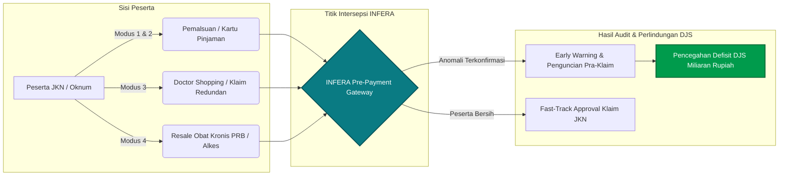

# INFERA: Integrated Fraud Early-Warning & Risk Analytics
### Enterprise Anti-Fraud Decision Support System & Autonomous Investigation Agent for BPJS Kesehatan
**BPJS Kesehatan HealthAthon — Kategori Inovasi: Efisiensi Risiko pada Peserta**

---

[](https://bpjs-kesehatan.go.id/)
[](https://github.com/agissugandi7203-ops/Healthkathon)
[](https://bpjs-kesehatan.go.id/)
[](https://react.dev/)
[](https://www.typescriptlang.org/)
[](https://tailwindcss.com/)
[](https://expressjs.com/)
[](https://supabase.com/)
[](https://openrouter.ai/)
[](https://elevenlabs.io/)
[](http://localhost:4000/docs)
[](https://turbo.build/)

```
 ██╗███╗   ██╗███████╗███████╗██████╗  █████╗ 
 ██║████╗  ██║██╔════╝██╔════╝██╔══██╗██╔══██╗
 ██║██╔██╗ ██║█████╗  █████╗  ██████╔╝███████║
 ██║██║╚██╗██║██╔══╝  ██╔══╝  ██╔══██╗██╔══██║
 ██║██║ ╚████║██║     ███████╗██║  ██║██║  ██║
 ╚═╝╚═╝  ╚═══╝╚═╝     ╚══════╝╚═╝  ╚═╝╚═╝  ╚═╝
 Integrated Fraud Early-Warning & Risk Analytics
```

---

## Daftar Isi

1. [Ringkasan Eksekutif & Value Proposition](#1-ringkasan-eksekutif--value-proposition)
2. [Latar Belakang Integritas Dana Jaminan Sosial (DJS)](#2-latar-belakang-integritas-dana-jaminan-sosial-djs)
3. [Taksonomi Modus Fraud & Formulasi Algoritma Deteksi](#3-taksonomi-modus-fraud--formulasi-algoritma-deteksi)
   - [Modus 1 & 2: Pemalsuan & Penyalahgunaan Kartu (Impossible Travel)](#a-modus-1--2-pemalsuan--penyalahgunaan-identitas-impossible-travel)
   - [Modus 3: Pelayanan Tidak Perlu & Doctor Shopping (DSI)](#b-modus-3-pelayanan-tidak-perlu--doctor-shopping-dsi)
   - [Modus 4: Penyalahgunaan Obat PRB & Alat Kesehatan](#c-modus-4-penyalahgunaan-obat-kronis-prb--alat-kesehatan)
   - [Matriks Scoring Risiko Multi-Faktor](#d-matriks-scoring-risiko-multi-faktor)
4. [Arsitektur Agen AI Forensik & Orchestrator Tools](#4-arsitektur-agen-ai-forensik--orchestrator-tools)
   - [Alur Kerja SSE (Server-Sent Events)](#a-alur-kerja-sse-server-sent-events)
   - [Katalog 9 Forensic Investigation Tools](#b-katalog-9-forensic-investigation-tools)
   - [Strict Two-Way Human-in-the-Loop Governance](#c-strict-two-way-human-in-the-loop-governance)
   - [Matriks Hak Akses Berjenjang (RBAC Matrix)](#d-matriks-hak-akses-berjenjang-rbac-matrix)
5. [4 Kasus Forensik Benchmark Terverifikasi](#5-4-kasus-forensik-benchmark-terverifikasi)
6. [Fitur Unggulan Platform](#6-fitur-unggulan-platform)
   - [Interactive AI Multimodal Voice & Avatar Engine (Vera & Luna)](#a-interactive-ai-multimodal-voice--avatar-engine-vera--luna)
   - [Real-Time Live Claim Stream Simulation Engine](#b-real-time-live-claim-stream-simulation-engine)
   - [Enterprise SaaS UI dengan Dark & Light Mode Persistence](#c-enterprise-saas-ui-dengan-dark--light-mode-persistence)
7. [Arsitektur Monorepo & Struktur Direktori](#7-arsitektur-monorepo--struktur-direktori)
8. [Konfigurasi Lingkungan & Variabel (.env)](#8-konfigurasi-lingkungan--variabel-env)
9. [Panduan Instalasi & Menjalankan Lokal](#9-panduan-instalasi--menjalankan-lokal)
10. [Dokumentasi Interaktif API (Swagger / OpenAPI 3.0)](#10-dokumentasi-interaktif-api-swagger--openapi-30)
11. [Panduan Deployment Produksi](#11-panduan-deployment-produksi)
    - [Deployment Frontend di Vercel](#a-deployment-frontend-di-vercel)
    - [Deployment Backend API di Railway](#b-deployment-backend-api-di-railway)
    - [Migrasi Supabase Database & pgvector RAG](#c-migrasi-supabase-database--pgvector-rag)
12. [Kepatuhan Regulasi & Landasan Hukum JKN](#12-kepatuhan-regulasi--landasan-hukum-jkn)
13. [Tim Pengembang, Hak Cipta & Lisensi](#13-tim-pengembang-hak-cipta--lisensi)

---

## 1. Ringkasan Eksekutif & Value Proposition

**INFERA (Integrated Fraud Early-Warning & Risk Analytics)** adalah sistem pendukung keputusan (*Clinical & Administrative Decision Support System*) dan asisten agen investigasi otonom berbasis *Artificial Intelligence* (AI) yang dirancang khusus untuk memitigasi inefisiensi dan indikasi kecurangan (*fraud*) pada Program Jaminan Kesehatan Nasional (JKN) yang dikelola oleh BPJS Kesehatan.

Sistem audit konvensional yang mengandalkan verifikasi pasca-bayar (*post-payment audit*) memiliki kelemahan mendasar:
1. **Retrospektif & Terlambat:** Klaim fraud baru teridentifikasi berminggu-minggu hingga berbulan-bulan setelah dana jaminan sosial (DJS) dicairkan ke faskes, menyebabkan *recovery rate* dana yang sangat rendah.
2. **Kelebihan Beban Auditor Manusia:** Rasio jutaan transaksi klaim bulanan berbanding jumlah verifikator/auditor menciptakan *bottleneck* investigasi.
3. **Analisis Sektoral Terisolasi (*Data Silos*):** Sering kali audit faskes, apotek, dan data demografi peserta terpisah, sehingga anomali lintas faskes seperti *impossible travel* atau *doctor shopping* luput dari pengawasan.

**INFERA memecahkan problematika tersebut melalui 3 pilar revolusioner:**
- **Deteksi Real-Time di Hulu (Pre-Payment Early Warning):** Mengevaluasi setiap penerbitan Surat Eligibilitas Peserta (SEP) dan pengajuan klaim dalam latensi $< 30\text{ ms}$ menggunakan *deterministic analytical streaming*.
- **Autonomous Forensic Agent dengan 9 Tools Function Calling:** LLM tidak bertindak sebagai *generative chatbot* yang mengarang data (*anti-hallucination*), melainkan sebagai orkestrator investigasi forensik berstandar kepolisian/kejaksaan yang memanggil *tools analitik terverifikasi*.
- **Strict Two-Way Human-in-the-Loop Governance:** AI mengusulkan tindakan pencegahan berjenjang, namun seluruh aksi administratif destruktif (seperti pemblokiran kartu, pembatalan klaim, atau teguran faskes) **wajib** melalui persetujuan verifikator/auditor manusia melalui modal otorisasi formal berlandaskan hukum.

---

## 2. Latar Belakang Integritas Dana Jaminan Sosial (DJS)

Berdasarkan laporan global *Healthcare Financial Management Association* (HFMA) dan *European Healthcare Fraud and Corruption Network* (EHFCN), kebocoran dana akibat kecurangan dalam skema asuransi kesehatan nasional berkisar antara **3% hingga 10%** dari total pengeluaran klaim tahunan.

Dalam skala Program JKN yang mencakup lebih dari **270 juta jiwa**, potensi kebocoran ini mencapai triliunan rupiah per tahun. Kategori lomba **"Efisiensi Risiko pada Peserta"** HealthAthon BPJS Kesehatan berfokus pada sisi yang selama ini paling sulit diawasi: **Fraud yang bersumber dari atau melibatkan penyalahgunaan identitas peserta**.



INFERA menargetkan efisiensi fiskal DJS dengan menghentikan pembayaran klaim fiktif sebelum dana ditransfer, melindungi hak peserta yang sah, dan menjaga kesinambungan aktuaria jangka panjang BPJS Kesehatan.

---

## 3. Taksonomi Modus Fraud & Formulasi Algoritma Deteksi

INFERA mengimplementasikan 4 mesin deteksi matematis untuk 4 tipologi modus risiko peserta sesuai regulasi resmi Kementerian Kesehatan dan BPJS Kesehatan:

```
┌───────────────────────────────────────────────────────────────────────────────────────┐
│                           TAKSONOMI 4 MODUS FRAUD INFERA                              │
├───────────────────────┬──────────────────────────┬────────────────────────────────────┤
│ MODUS                 │ NAMA POLA FRAUD          │ FORMULA INTI / ENGINE              │
├───────────────────────┼──────────────────────────┼────────────────────────────────────┤
│ Modus 1               │ Pemalsuan Data/Identitas │ Biological Discordance & NIK Hash  │
│ Modus 2               │ Kartu Pinjaman           │ Impossible Travel Haversine Speed  │
│ Modus 3               │ Pelayanan Tidak Perlu    │ Doctor Shopping Index (DSI)        │
│ Modus 4               │ Penyalahgunaan PRB/Alkes │ Prescription Overlap Ratio (POR)   │
└───────────────────────┴──────────────────────────┴────────────────────────────────────┘
```

---

### A. Modus 1 & 2: Pemalsuan & Penyalahgunaan Identitas (Impossible Travel)

#### 1. Kecepatan Perjalanan Spasial-Temporal (Impossible Travel Velocity)
Mendeteksi apakah kartu peserta yang sama diterbitkan SEP di dua fasilitas kesehatan yang berbeda dalam selang waktu yang secara fisik mustahil ditempuh:

$$V_{\text{travel}} = \frac{d(\text{lat}_1, \text{lng}_1, \text{lat}_2, \text{lng}_2)}{\Delta t}$$

Dimana jarak geodesik dihitung menggunakan formula **Haversine**:

$$a = \sin^2\left(\frac{\Delta \phi}{2}\right) + \cos(\phi_1)\cos(\phi_2)\sin^2\left(\frac{\Delta \lambda}{2}\right)$$

$$d = 2R \cdot \text{atan2}\left(\sqrt{a}, \sqrt{1-a}\right)$$

- $R = 6.371\text{ km}$ (Radius rata-rata bumi).
- $\phi_1, \phi_2$ adalah lintang (latitude) faskes 1 dan faskes 2 dalam radian.
- $\Delta \lambda$ adalah selisih bujur (longitude) faskes dalam radian.
- $\Delta t = |t_2 - t_1|$ dalam satuan jam.

**Threshold Keputusan:**
- $V_{\text{travel}} > 100\text{ km/jam}$ dengan $\Delta t \le 2\text{ jam}$: **HIGH RISK** (Penyalahgunaan Identitas / Kartu Pinjaman).
- $V_{\text{travel}} > 150\text{ km/jam}$ atau $\Delta t \le 45\text{ menit}$ lintas kota: **CRITICAL RISK** (Pasti Anomali Fisik / Kartu Digandakan).

#### 2. Diskordansi Biologis Mutlak (Absolute Biological Discordance)
Mengevaluasi kesesuaian parameter demografi biologis paten (jenis kelamin) terhadap diagnosis ICD-10 dan tindakan medis:

$$\text{Discordance}(\text{Peserta}, \text{SEP}) = 
\begin{cases} 
1 & \text{jika } \text{Gender}(\text{Peserta}) = \text{'L'} \land \text{Diagnosa} \in \{\text{O00-O99}\} \text{ (Obstetri/Sesar)} \\
1 & \text{jika } \text{Gender}(\text{Peserta}) = \text{'P'} \land \text{Diagnosa} \in \{\text{N40-N51}\} \text{ (Prostat/Testis)} \\
0 & \text{lainnya (Biologis Selaras)}
\end{cases}$$

Jika nilai bernilai 1, sistem langsung menetapkan skor keparahan **99/100 (CRITICAL)** karena terbukti mutlak terjadi pemalsuan identitas untuk klaim pihak ketiga.

---

### B. Modus 3: Pelayanan Tidak Perlu & Doctor Shopping (DSI)

Peserta berpindah-pindah dokter atau rumah sakit dalam interval waktu sangat pendek untuk keluhan subjektif yang sama (*frequent flyers*), demi memperoleh pemeriksaan penunjang mahal berulang atau penimbunan resep simptomatis.

#### Formula Doctor Shopping Index ($DSI$):

$$DSI = \frac{\sum_{i=1}^{N-1} \mathbb{I}\Big(\Delta t_{(i, i+1)} \le 7\text{ hari} \ \land \ \text{ICD}_{i} \sim \text{ICD}_{i+1} \ \land \ \text{PPK}_i \ne \text{PPK}_{i+1}\Big)}{N_{\text{total\_kunjungan}} - 1}$$

Dimana:
- $\mathbb{I}(\dots)$ adalah operator indikator logika biner (1 jika kondisi terpenuhi, 0 jika tidak).
- $\text{ICD}_{i} \sim \text{ICD}_{i+1}$ menunjukkan kesamaan *3-character category* ICD-10 (misalnya `R42` Vertigo).
- $\text{PPK}_i \ne \text{PPK}_{i+1}$ menandakan kunjungan dilakukan pada fasilitas kesehatan yang berbeda.

**Threshold Keputusan:**
- $DSI \ge 0.50$ dengan kunjungan $\ge 3$ faskes dalam 14 hari: **HIGH RISK** (Indikasi kuat *Doctor Shopping*).
- $DSI \ge 0.80$ dengan frekuensi $\ge 5$ faskes dalam 10 hari: **CRITICAL RISK** (Klaim redundan tidak berindikasi medis).

---

### C. Modus 4: Penyalahgunaan Obat Kronis PRB & Alat Kesehatan

#### 1. Rasio Tumpang Tindih Resep Kronis (Prescription Overlap Ratio - $POR$)
Mendeteksi praktik penebusan resep Program Rujuk Balik (PRB) diabetes melitus atau hipertensi sebelum jatah 30 hari habis di multi-apotek jejaring untuk motif penjualan kembali (*resale arbitrage*):

$$POR = \frac{\sum_{k} \text{Kuantitas Hari Suplai Obat Diperoleh dalam Jendela } T}{T_{\text{hari}}} \times 100\%$$

- $T_{\text{hari}} = 30\text{ hari}$ (Standar siklus penjaminan obat kronis BPJS Kesehatan).
- Jika pasien menebus 90 hari suplai obat dalam tempo 22 hari, maka:

$$POR = \frac{90}{30} \times 100\% = 300\% \quad (\text{Surplus } 200\%)$$

**Threshold Keputusan:**
- $POR \le 100\%$: Normal (Sesuai dosis medis standar).
- $101\% - 130\%$: Normal Variance (Toleransi fleksibilitas jadwal kontrol dokter).
- $> 140\%$: **CRITICAL RISK** (Penimbunan obat PRB bernilai tinggi).

#### 2. Pelanggaran Masa Tunggu Alat Kesehatan (Cooling-off Period)
Berdasarkan ketentuan penjaminan alat kesehatan BPJS Kesehatan:

$$\Delta t_{\text{alkes}} = t_{\text{klaim\_baru}} - t_{\text{klaim\_sebelumnya}}$$

$$\text{Valid}(\text{Alkes}) = 
\begin{cases} 
\text{Tolak Klaim} & \text{jika Kacamata } \land \Delta t_{\text{alkes}} < 730\text{ hari (2 Tahun)} \\
\text{Tolak Klaim} & \text{jika Kursi Roda } \land \Delta t_{\text{alkes}} < 1.825\text{ hari (5 Tahun)} \\
\text{Tolak Klaim} & \text{jika Alat Bantu Dengar } \land \Delta t_{\text{alkes}} < 1.825\text{ hari (5 Tahun)} \\
\text{Setujui} & \text{jika memenuhi masa tunggu}
\end{cases}$$

---

### D. Matriks Scoring Risiko Multi-Faktor

Skor risiko komprehensif ($S_{\text{total}}$) dihitung dengan model pembobotan multi-dimensi ternormalisasi (0 - 100):

$$S_{\text{total}} = \min\left(100, \sum_{m=1}^{4} w_m \cdot S_m + \sum \beta_{\text{penambah}}\right)$$

| Komponen | Bobot ($w_m$) | Parameter Evaluasi |
| :--- | :---: | :--- |
| **Penyalahgunaan Identitas** | 0.35 | $V_{\text{travel}}$, anomali geospasial, NIK duplikasi |
| **Diskordansi Biologis** | 0.40 | Gender vs diagnosa obstetri / urologi spesifik |
| **Doctor Shopping & Over-Utilization** | 0.25 | Indeks DSI, rasio kunjungan poli rawat jalan |
| **Penyalahgunaan Farmasi & Alkes**| 0.25 | Rasio POR obat kronis, pelanggaran cooling-off |

| Rentang Skor | Level Risiko | Rekomendasi Tindakan Default |
| :---: | :---: | :--- |
| **$0 - 39$** | `LOW` | Penjaminan Normal (*Fast-Track Payment Approved*) |
| **$40 - 69$** | `MEDIUM` | Verifikasi Administrasi Lanjutan & Audit Sampel Berkala |
| **$70 - 84$** | `HIGH` | Penerbitan Surat Peringatan & Konseling Dokter Keluarga |
| **$85 - 100$** | `CRITICAL` | **Penangguhan Sementara Eligibilitas & Investigasi Lapangan** |

---

## 4. Arsitektur Agen AI Forensik & Orchestrator Tools

Inti inovasi teknologi INFERA adalah **Autonomous Investigation Agent** yang dijalankan oleh mesin orchestrator berbasis OpenRouter multi-LLM (`openai/gpt-oss-120b:nitro`, `google/gemini-2.0-flash-001`, `meta-llama/llama-3.3-70b-instruct`) dengan mekanisme *Tool / Function Calling*.

### A. Alur Kerja SSE (Server-Sent Events)

Agen berkomunikasi dengan frontend melalui streaming Server-Sent Events (SSE) yang menampilkan pemanggilan tool (*tool invocation*), status evaluasi, dan penyusunan rekomendasi secara transparan dan terukur:

```mermaid
sequenceDiagram
    autonumber
    actor Auditor as Auditor BPJS
    participant Web as INFERA Web Client (React 19)
    participant Agent as OpenRouter Agent Orchestrator
    participant Reg as Tool Registry (9 Tools)
    participant DB as Supabase PostgreSQL & pgvector

    Auditor->>Web: Masukkan Perintah ("Audit dugaan kartu pinjaman Budi Santoso")
    Web->>Agent: Inisiasi Stream SSE dengan Konteks Aktif
    Agent->>Reg: Panggil analyze_participant(query: "Budi Santoso")
    Reg->>DB: Query master profil peserta & riwayat SEP
    DB-->>Reg: Data 2 kunjungan (Solo & Semarang dalam 45 menit)
    Reg-->>Agent: JSON Result Envelopes
    Web<<--Agent: SSE Event: tool.complete ("Profil & Riwayat SEP Ditemukan")
    
    Agent->>Reg: Panggil detect_fraud_pattern(type: "impossible_travel")
    Reg-->>Agent: Kecepatan 180 km/jam (CRITICAL ANOMALY)
    Web<<--Agent: SSE Event: tool.complete ("Anomali Impossible Travel Terverifikasi")

    Agent->>Reg: Panggil search_regulations_rag(query: "Peminjaman kartu sanksi Permenkes 16/2019")
    Reg->>DB: Semantic Vector Match (pgvector cosine similarity)
    DB-->>Reg: Pasal 6 Permenkes 16/2019 & KUHP 263
    Reg-->>Agent: Regulasi Resmi Terverifikasi

    Agent->>Reg: Panggil propose_participant_suspension(...)
    Reg-->>Agent: Draft Usulan Rekomendasi (Two-Phase Model)
    Agent-->>Web: SSE Event: onDone (Sintesis Narasi Forensik & Action Card)
    Web->>Auditor: Render Kartu Rekomendasi + Suara Audio (Vera)
```

---

### B. Katalog 9 Forensic Investigation Tools

INFERA dilengkapi dengan 9 tools forensik deterministik yang terdaftar dalam `apps/web/src/features/dashboard/services/tools/toolRegistry.ts`:

| No | Nama Tool | Kategori | Deskripsi Fungsi | Parameter Kunci |
| :---: | :--- | :---: | :--- | :--- |
| **1** | `get_participant_profile` / `analyze_participant` | Read | Menarik data demografi, NIK tersamar, faskes FKTP terdaftar, dan riwayat iuran dari master data. | `participant_query`, `include_encounters` |
| **2** | `get_claim_history` | Read | Mengambil rekam jejak kronologis SEP faskes, diagnosa ICD-10, prosedur ICD-9-CM, dan tarif INA-CBG. | `participant_id` |
| **3** | `run_fraud_indicators` / `detect_fraud_pattern` | Analysis | Menjalankan formula matematika analitik: Impossible Travel, Doctor Shopping DSI, PRB Resale, atau Diskordansi Biologis. | `pattern_type`, `target_id` |
| **4** | `compute_fraud_risk_score` / `calculate_risk_score` | Analysis | Menghitung akumulasi skor risiko fraud (0 - 100) dan mengklasifikasikan tingkat keparahan risiko. | `target_id` |
| **5** | `search_regulations` / `search_regulations_rag` | Legal RAG | Menelusuri pasal regulasi resmi JKN melalui pencarian semantik vektor (UU 40/2004, Permenkes 16/2019, KUHP 263). | `query`, `category` |
| **6** | `get_faskes_profile` | Verification | Memvalidasi kredensial faskes penyelenggara, kelas RS, kepatuhan klaim, dan histori penolakan berkas. | `ppk_code` |
| **7** | `trigger_action_recommendation` | Governance | Mengajukan usulan tindakan berjenjang (audit lapangan, verifikasi biometrik, penangguhan sementara, surat klarifikasi). | `action_type`, `target_id`, `severity`, `legal_basis` |
| **8** | `calculate_financial_loss` | Actuarial | Mengalkulasi total potensi kerugian finansial Dana Jaminan Sosial (DJS) secara presisi. | `target_id`, `include_projected` |
| **9** | `export_audit_report` / `propose_case_review` | Reporting | Menyusun berkas berita acara hasil pemeriksaan forensik terstruktur dan pintasan rute investigasi. | `case_id`, `patient_name`, `target_workflow_route` |

---

### C. Strict Two-Way Human-in-the-Loop Governance

Salah satu pilar etika AI terpenting dalam INFERA adalah **larangan eksekusi tindakan administratif secara sepihak oleh model AI**.

```
   ┌─────────────────────────────────────────────────────────────┐
   │                   FASE 1: REKOMENDASI AI                    │
   │  AI memproses bukti forensik, menghitung skor risiko,       │
   │  mengutip regulasi hukum, dan MEMBUAT DRAFT USULAN TINDAKAN.│
   └──────────────────────────────┬──────────────────────────────┘
                                  │
                                  ▼
   ┌─────────────────────────────────────────────────────────────┐
   │             FASE 2: HUMAN OVERSIGHT & KONFIRMASI            │
   │  Auditor manusia meninjau bukti pada ActionConfirmationModal│
   │  Memberikan catatan pertimbangan & membubuhkan persetujuan. │
   └──────────────────────────────┬──────────────────────────────┘
                                  │
                                  ▼
   ┌─────────────────────────────────────────────────────────────┐
   │                   EKSEKUSI ADMINISTRATIF                    │
   │  Tindakan (Penangguhan Kartu / Surat Panggilan / Audit)     │
   │  dieksekusi resmi ke sistem BPJS dengan jejak audit sah.    │
   └─────────────────────────────────────────────────────────────┘
```

#### Komponen Otorisasi `ActionConfirmationModal.tsx`:
- **Peringatan Tingkat Keparahan:** Visual header merah marun untuk level `CRITICAL` (Suspensi) dan oranye amber untuk level `HIGH` (Peringatan).
- **Checklist Kepatuhan Hukum:** Auditor wajib mencentang klausul persetujuan kepatuhan regulasi sebelum tombol eksekusi aktif.
- **Catatan Wajib Auditor (*Auditor Notes*):** Setiap persetujuan mewajibkan justifikasi tertulis yang disimpan permanen ke dalam tabel `audit_access_logs` PostgreSQL demi akuntabilitas hukum.

---

### D. Matriks Hak Akses Berjenjang (RBAC Matrix)

Sistem membedakan izin pemanggilan tools berdasarkan peran pengguna (*User Roles*):

| Forensic Tool / Operasi | Tamu Publik (`anon`) | Verifikator Faskes (`analyst`) | Auditor Investigasi (`auditor`) | Direksi / Administrator (`admin`) |
| :--- | :---: | :---: | :---: | :---: |
| `analyze_participant` | `Restricted` | `Authorized` | `Authorized` | `Authorized` |
| `get_claim_history` | `Restricted` | `Authorized` | `Authorized` | `Authorized` |
| `detect_fraud_pattern` | `Restricted` | `Authorized` | `Authorized` | `Authorized` |
| `calculate_risk_score` | `Restricted` | `Authorized` | `Authorized` | `Authorized` |
| `search_regulations_rag` | `Restricted` | `Authorized` | `Authorized` | `Authorized` |
| `propose_case_review` | `Restricted` | `Authorized` | `Authorized` | `Authorized` |
| `propose_warning_letter` | `Restricted` | `Restricted` | **`Authorized`** | **`Full Authority`** |
| `propose_participant_suspension` | `Restricted` | `Restricted` | **`Authorized`** | **`Full Authority`** |
| **Eksekusi Pembatalan Klaim/SEP** | `Restricted` | `Restricted` | **`Dual-Approval`** | **`Full Authority`** |

---

## 5. 4 Kasus Forensik Benchmark Terverifikasi

INFERA menyertakan 4 studi kasus benchmark riil yang mencerminkan skenario nyata audit kepesertaan JKN:

| Kode Kasus | Nama Peserta (Masked) | Modus Utama | Skor Risiko | Kerugian DJS | Dasar Hukum Regulasi |
| :---: | :--- | :--- | :---: | :---: | :--- |
| **CASE-001** | Budi Santoso (`3374**********01`) | Peminjaman Kartu (Impossible Travel) | **96/100** | Rp 8.400.000 | Peraturan BPJS No. 6/2020 & KUHP 263 |
| **CASE-002** | Hendra Wijaya (`3273**********88`) | Doctor Shopping (Vertigo Redundan) | **88/100** | Rp 4.200.000 | Permenkes No. 16/2019 & No. 28/2014 |
| **CASE-003** | Nurul Hidayati (`1271**********54`) | Resale Arbitrase Obat Kronis PRB | **94/100** | Rp 6.300.000 | Permenkes No. 16/2019 & Panduan PRB |
| **CASE-004** | Agus Pratama (`3578**********11`) | Diskordansi Biologis Mutlak (Sesar) | **99/100** | Rp 12.800.000 | Permenkes No. 16/2019 Ps. 6 & KUHP 263 |

---

### Uraian Detil Skenario Kasus:

#### 1. Kasus 1: Budi Santoso (`HK-ID-SHARING-2026`)
- **Kronologi Anomali:** Nomor kartu `0001847291038` terbit SEP No. `1114R0010926V0001` di RSUD Dr. Moewardi Surakarta pada pk. 08:30 WIB (Rawat Inap, diagnosa infark miokard akut $I21.0$, tarif Rp 8.400.000). Tepat 45 menit kemudian (pk. 09:15 WIB), terbit SEP kedua No. `1101R0050926V0042` di RS Mitra Husada Semarang (Rawat Jalan, diagnosa low back pain $M54.5$, tarif Rp 320.000).
- **Bukti Forensik:** Jarak kedua faskes adalah 63.5 km hingga 110 km via darat. Kecepatan implisit perjalanan mencapai **$180\text{ km/jam}$**, melampaui batas fisik kewajaran.
- **Rekomendasi AI:** Pembatalan SEP berjalan, penerbitan tagihan ganti rugi Rp 8.400.000, dan penangguhan sementara kepesertaan.

#### 2. Kasus 2: Hendra Wijaya (`HK-DOC-SHOPPING-2026`)
- **Kronologi Anomali:** Peserta mendatangi 5 fasilitas kesehatan berbeda (3 klinik pratama dan 2 RS swasta) di Kota Bandung dalam kurun waktu 10 hari, seluruhnya dengan keluhan pusing/vertigo ringan ($R42$).
- **Bukti Forensik:** Terjadi duplikasi peresepan obat simptomatis dan rujukan pemeriksaan CT-Scan kepala berulang tanpa adanya indikasi kegawatdaruratan neurologis. Nilai **$DSI = 1.00$**.
- **Rekomendasi AI:** Penguncian eligibilitas rujukan spesialis mandiri, audit faskes pemberi rujukan, dan konseling wajib melalui dokter keluarga FKTP.

#### 3. Kasus 3: Nurul Hidayati (`HK-PRB-RESALE-2026`)
- **Kronologi Anomali:** Peserta Program Rujuk Balik (PRB) diabetes melitus tipe 2 menebus Insulin Glargine Pen dan Amlodipine 10mg sebanyak **90 hari pakai hanya dalam tempo 22 hari** melalui 3 apotek jejaring berbeda di Kota Medan.
- **Bukti Forensik:** Rasio tumpang tindih resep $POR = 300\%$ (surplus 190% obat). Terindikasi kuat bahwa surplus obat kronis bermerk ini diperjualbelikan kembali (*resale*) ke pasar bebas.
- **Rekomendasi AI:** Pemblokiran akses penebusan apotek jejaring mandiri, pembatasan jatah obat dengan pengawasan ketat, dan program Pengawasan Minum Obat (PMO) langsung di Puskesmas.

#### 4. Kasus 4: Agus Pratama (`HK-ID-FALSIFY-2026`)
- **Kronologi Anomali:** Kartu peserta BPJS No. `0004928172938` atas nama Agus Pratama, berjenis kelamin **Laki-Laki**, usia 42 tahun, digunakan untuk mendaftar rawat inap tindakan persalinan **Seksio Sesarea (*Delivery by Elective Caesarean Section* - $O82.0$)** di RS Swasta Surabaya dengan klaim Rp 12.800.000.
- **Bukti Forensik:** Diskordansi biologis mutlak ($100\%$ anomali gender). Kartu terbukti dipinjamkan/disewakan kepada pasien wanita non-peserta JKN.
- **Rekomendasi AI:** Penolakan klaim 100%, penerbitan Berita Acara Pelanggaran Pidana (KUHP 263), dan pembebanan biaya perawatan mandiri kepada keluarga pasien.

---

## 6. Fitur Unggulan Platform

### A. Interactive AI Multimodal Voice & Avatar Engine (Vera & Luna)

INFERA menghadirkan asisten avatar visual cerdas yang dilengkapi ekspresi emosional dan sintesis suara neural tingkat tinggi:
- **Teknologi Render Canvas/SVG:** Dibangun di atas PixiJS v8 dan GSAP untuk render animasi 60 FPS tanpa membebani GPU/CPU pengguna.
- **Dynamic Emotional States:** Avatar secara adaptif mengubah ekspresi berdasarkan konteks pembicaraan:
  - `normal`: Siap siaga mendengarkan.
  - `thinking`: Berpikir saat tool forensik sedang dieksekusi.
  - `surprised`: Terkejut saat menemukan anomali kritis ($S > 85$).
  - `confused`: Menganalisis parameter yang bertolak belakang.
  - `speaking`: Animasi bibir (*lip-sync*) sinkron dengan aliran audio ElevenLabs.
  - `listening`: Mode pengenalan suara auditor (*Speech-to-Text*).
- **Dual Voice Identity (ElevenLabs TTS):**
  - **Vera (Default AI Voice):** Suara ramah, jernih, dan profesional (`GgFtkxszsIQcD4MYvQax`).
  - **Luna (Secondary Voice):** Karakter vokal lembut dan tenang (`0csCu4D7iyBsmlVlf9Iu`), dapat ditukar instan via klik kanan widget avatar.
  - **Voice Auditor & Analyst System:** Profil vokal tegas dan formal (`onwK4e9ZLuTAKqWW03F9`) untuk pembacaan berita acara audit resmi.

---

### B. Real-Time Live Claim Stream Simulation Engine

Untuk pengujian tanpa henti (*zero-downtime demonstration*), INFERA dilengkapi mesin simulasi penerbitan klaim otomatis yang terkalibrasi dengan realitas data BPJS Kesehatan:
- **Data Medis Realistis:** Diagnosis ICD-10 nyata, kode tindakan ICD-9-CM, pengelompokan tarif INA-CBG resmi, kelas RS (A, B, C, FKTP), dan jenis perawatan (Ranap vs Ralan).
- **Poisson Arrival Rate:** Aliran klaim dapat diatur kecepatannya (1 klaim/detik hingga 10 klaim/detik) untuk mensimulasikan beban puncak (*peak hour*) kantor cabang BPJS.
- **Preset Injeksi Anomali:** Auditor dapat memicu skenario fraud secara instan (Impossible Travel Solo-Semarang, Overlap PRB, atau Diskordansi Sesar) untuk menguji keandalan deteksi sistem secara *live*.

---

### C. Enterprise SaaS UI dengan Dark & Light Mode Persistence

Antarmuka INFERA dirancang dengan standar desain enterprise modern:
- **Medical Theme Palette:** Palet warna Emerald BPJS, Medical Cyan, Deep Slate, dan Crimson Alert yang ergonomis untuk auditor yang bekerja berjam-jam.
- **Seamless Theme Switching:** Toggle Dark Mode & Light Mode mulus dengan sinkronisasi otomatis ke `localStorage` dan preferensi sistem operasi (`prefers-color-scheme`).
- **Responsive Data Visualizations:** Grafik donat komposisi modus, tren risiko geospasial, dan kartu metrik KPI yang adaptif di berbagai resolusi layar.

---

## 7. Arsitektur Monorepo & Struktur Direktori

Repository ini menggunakan arsitektur **Turborepo / npm Workspaces** yang memisahkan tanggung jawab kode secara modular (*Strict Boundary Separation*):

```text
infera-monorepo/
├── apps/
│   ├── api/                              # Backend Express & TypeScript Service (Port 4000)
│   │   ├── src/
│   │   │   ├── config/                   # Validasi Zod environment variables (env.ts)
│   │   │   ├── controllers/              # HTTP Request Controllers (AI, Health, Risk, RAG)
│   │   │   │   ├── ai.controller.ts
│   │   │   │   ├── participant-risk.controller.ts
│   │   │   │   └── rag.controller.ts
│   │   │   ├── middleware/               # Auth guard, rate limiter, centralized error handler
│   │   │   ├── routes/                   # Endpoint REST routing (/api/v1/*)
│   │   │   ├── services/                 # Layanan bisnis utama & integrasi vendor
│   │   │   │   ├── openrouter.service.ts # Adapter LLM OpenRouter dengan fallback
│   │   │   │   ├── participant-risk.service.ts # Implementasi algoritma 4 modus fraud
│   │   │   │   ├── rag.service.ts        # Pencarian vektor regulasi JKN
│   │   │   │   └── supabase.service.ts   # Client Supabase dengan fallback sandbox
│   │   │   ├── utils/                    # Standar API Envelope & AppError
│   │   │   ├── app.ts                    # Express application setup & middleware chain
│   │   │   └── server.ts                 # HTTP server bootstrap entrypoint
│   │   ├── package.json
│   │   └── tsconfig.json
│   │
│   └── web/                              # Frontend React 19 / Vite SPA (Port 5173)
│       ├── src/
│       │   ├── components/common/        # UI Primitives (Navbar, Footer, ErrorBoundary)
│       │   ├── context/                  # ThemeContext (Dark/Light mode provider)
│       │   ├── features/
│       │   │   ├── auth/                 # Modal otorisasi login auditor
│       │   │   └── dashboard/            # Modul fungsional dashboard investigasi
│       │   │       ├── avatar/           # PixiJS + GSAP Multimodal Anime Avatar Engine
│       │   │       │   ├── AvatarCanvas.tsx
│       │   │       │   ├── AvatarController.ts
│       │   │       │   └── CharacterModel.ts
│       │   │       ├── components/       # Kartu rekomendasi, ActionConfirmationModal, chat
│       │   │       ├── layout/           # Sidebar navigasi & TopNav profil auditor
│       │   │       ├── pages/            # Halaman rute audit:
│       │   │       │   ├── OverviewPage.tsx          # Ringkasan KPI & feed anomali
│       │   │       │   ├── CasesDeepDivePage.tsx     # 4 Kasus benchmark mendalam
│       │   │       │   ├── IdentityRiskPage.tsx      # Modus 1 & 2 (Peta Spasial)
│       │   │       │   ├── UnnecessaryServicesPage.tsx # Modus 3 (Analisis DSI)
│       │   │       │   ├── PharmacyAlkesPage.tsx     # Modus 4 (Audit PRB & Alkes)
│       │   │       │   ├── RegulationsPage.tsx       # RAG Hukum & Regulasi JKN
│       │   │       │   ├── TransactionsPage.tsx      # Log transaksi klaim & SEP
│       │   │       │   └── MasterDataPage.tsx        # Master data peserta & faskes
│       │   │       ├── services/         # Client-side agent & speech processor
│       │   │       │   ├── openrouterAgent.ts        # SSE Agent & intent planner
│       │   │       │   ├── speech.ts                 # Web Audio & ElevenLabs player
│       │   │       │   ├── tts-processor.ts          # Pemetaan prosodi & viseme emosi
│       │   │       │   └── tools/
│       │   │       │       └── toolRegistry.ts       # Registry 9 Tools Forensik
│       │   │       └── simulation/       # Engine generator simulasi klaim live
│       │   ├── lib/                      # Supabase & Axios client singleton
│       │   ├── routes/                   # Definisi rute React Router DOM v6
│       │   ├── App.tsx                   # Root Application component
│       │   └── main.tsx                  # Vite browser DOM mount
│       ├── package.json
│       └── vite.config.ts
│
├── packages/
│   └── shared/                           # Single Source of Truth Contracts & Types
│       ├── src/
│       │   ├── types.ts                  # Kontrak data peserta, klaim, dan hasil evaluasi
│       │   ├── tool.types.ts             # Definisi JSON Schema Tool Function Calling
│       │   ├── rag.types.ts              # Struktur dokumen regulasi & embedding vector
│       │   ├── simulation.types.ts       # Preset skenario & konfigurasi streaming klaim
│       │   ├── constants.ts              # Kode CBG, tarif standar, dan daftar faskes
│       │   └── index.ts                  # Shared library export gateway
│       ├── package.json
│       └── tsconfig.json
│
├── data/
│   ├── database/
│   │   └── schema_participant_risk.sql   # Skema DDL tabel PostgreSQL peserta & RLS
│   └── regulations/
│       ├── schema_supabase_rag.sql       # Skema tabel pgvector jkn_regulations & RPC
│       └── regulations_chunks.json       # Dataset pasal-pasal regulasi JKN terindeks
│
├── docs/
│   ├── BACKEND_ARCHITECTURE.md           # Spesifikasi teknis backend & pembuktian rumus
│   └── DATABASE_SECURITY.md              # Standar kepatuhan UU PDP & audit trail
│
├── scripts/
│   ├── test_participant_risk.ts          # Script validasi otomatis algoritma 4 modus
│   ├── build_rag_knowledge_base.py       # Pipeline indexing embeddings regulasi JKN
│   └── seed_regulations_rag.py           # Database seeder ke Supabase PostgreSQL
│
├── railway.json                          # Manifest deployment backend pada Railway
├── vercel.json                           # Manifest routing SPA deployment pada Vercel
├── rules.md                              # Standar kode arsitektur Anti-AI Slop
├── .env.example                          # Template konfigurasi variabel lingkungan
└── package.json                          # Monorepo root workspace orchestrator
```

---

## 8. Konfigurasi Lingkungan & Variabel (.env)

Tersedia template konfigurasi di `.env.example`. Buat berkas `.env` pada root project, `apps/api/.env`, dan `apps/web/.env`.

### A. Konfigurasi Backend (`apps/api/.env`)
```bash
# Server Port & Runtime
PORT=4000
NODE_ENV=development

# URL Frontend untuk CORS whitelist
CLIENT_URL=http://localhost:5173

# Supabase Credentials (PostgreSQL & pgvector)
SUPABASE_URL=https://your-project-id.supabase.co
SUPABASE_ANON_KEY=eyJhbGciOiJIUzI1NiIsInR5cCI6IkpXVCJ9...
SUPABASE_SERVICE_ROLE_KEY=eyJhbGciOiJIUzI1NiIsInR5cCI6IkpXVCJ9...

# OpenRouter AI Credentials (LLM Backend Gateway)
OPENROUTER_API_KEY=sk-or-v1-your-openrouter-key
OPENROUTER_DEFAULT_MODEL=openai/gpt-oss-120b:nitro
```

### B. Konfigurasi Frontend Web (`apps/web/.env`)
```bash
# URL Backend API Express
VITE_API_URL=http://localhost:4000/api/v1

# Supabase Client Credentials
VITE_SUPABASE_URL=https://your-project-id.supabase.co
VITE_SUPABASE_ANON_KEY=eyJhbGciOiJIUzI1NiIsInR5cCI6IkpXVCJ9...

# OpenRouter Direct Fallback (Opsional)
VITE_OPENROUTER_API_KEY=sk-or-v1-your-openrouter-key
VITE_DEFAULT_MODEL=openai/gpt-oss-120b:nitro

# ElevenLabs Neural Voice TTS
VITE_ELEVENLABS_API_KEY=your-elevenlabs-api-key
VITE_ELEVENLABS_VOICE_ID=GgFtkxszsIQcD4MYvQax
```

---

## 9. Panduan Instalasi & Menjalankan Lokal

Pastikan komputer Anda telah terpasang **Node.js (versi >= 20.0.0)** dan **npm**.

### Langkah 1: Kloning Repository
```bash
git clone https://github.com/agissugandi7203-ops/Healthkathon.git
cd Healthkathon
```

### Langkah 2: Instalasi Seluruh Dependensi Monorepo
Eksekusi instalasi pada root direktori. Npm workspaces akan menginstal dependensi untuk `apps/api`, `apps/web`, dan `packages/shared` sekaligus:
```bash
npm install
```

### Langkah 3: Build Paket Shared
Sebelum menjalankan aplikasi, kompilasi paket kontrak data `@healthathon/shared`:
```bash
npm run build:shared
```

### Langkah 4: Menjalankan Server Pengembangan (Dev Mode)
Anda dapat menjalankan backend dan frontend secara bersamaan menggunakan satu perintah:
```bash
npm run dev
```

*Atau jika ingin menjalankan secara terpisah di terminal yang berbeda:*
```bash
# Terminal 1: Backend Express API (Port 4000)
npm run dev:api

# Terminal 2: Frontend React SPA (Port 5173)
npm run dev:web
```

Buka browser Anda di `http://localhost:5173`. Dashboard INFERA siap digunakan!

### Langkah 5: Menjalankan Unit Testing & Validasi Algoritma
Uji keakuratan algoritma deteksi 4 modus fraud menggunakan script otomasi:
```bash
npx tsx scripts/test_participant_risk.ts
```

Output pengujian akan memverifikasi kalkulasi matematis $V_{\text{travel}}$, $DSI$, $POR$, dan diskordansi biologis terhadap 4 kasus benchmark:
```text
=== TEST PARTICIPANT RISK SERVICE (HEALTHKATHON 2026) ===
--- 1. Aggregated Metrics ---
Total Participants Audited: 42180
Total Potential DJS Loss Prevented: Rp 2.450.000.000
--- 2. Benchmark Case Studies (4 Moduses) ---
[HK-ID-SHARING-2026] Penyalahgunaan Identitas: Kartu Pinjaman (Impossible Travel)
[HK-DOC-SHOPPING-2026] Pelayanan Tidak Perlu: Doctor Shopping Kunjungan Redundan
[HK-PRB-RESALE-2026] Penyalahgunaan Obat: Resale Arbitrase Obat Kronis PRB
[HK-ID-FALSIFY-2026] Pemalsuan Data Identitas: Diskordansi Medis Gender Laki-Laki
>>> ALL PARTICIPANT RISK SERVICE TESTS PASSED SUCCESSFULLY! <<<
```

---

## 10. Dokumentasi Interaktif API (Swagger / OpenAPI 3.0)

Backend `apps/api` telah dilengkapi dengan dokumentasi interaktif **Swagger UI** berbasis standar formal **OpenAPI 3.0.3**. Auditor, pengembang, dan juri dapat menguji seluruh endpoint secara langsung melalui peramban:

### Akses Dokumentasi Swagger:
- **Swagger UI Interaktif:** [`http://localhost:4000/docs`](http://localhost:4000/docs) atau [`http://localhost:4000/api/v1/docs`](http://localhost:4000/api/v1/docs)
- **Spesifikasi OpenAPI 3.0 JSON:** [`http://localhost:4000/api-docs.json`](http://localhost:4000/api-docs.json) atau [`http://localhost:4000/docs/json`](http://localhost:4000/docs/json)

```
┌────────────────────────────────────────────────────────────────────────────────────────┐
│                          RINGKASAN ENDPOINT UTAMA INFERA API                           │
├───────────────────────────────┬────────┬───────────────────────────────────────────────┤
│ TAG / MODUL                   │ METHOD │ ENDPOINT PATH & DESKRIPSI                     │
├───────────────────────────────┼────────┼───────────────────────────────────────────────┤
│ System & Health               │ GET    │ /api/v1/health (Liveness check sistem)        │
│                               │ GET    │ /api/v1/health/detailed (DB Supabase & AI)    │
├───────────────────────────────┼────────┼───────────────────────────────────────────────┤
│ Auth & Session                │ GET    │ /api/v1/auth/me (Profil pengguna saat ini)    │
│                               │ POST   │ /api/v1/auth/login (Otentikasi kredensial)    │
├───────────────────────────────┼────────┼───────────────────────────────────────────────┤
│ Participant Risk Analytics    │ GET    │ /api/v1/participant-risk/aggregate (Metrik)   │
│                               │ GET    │ /api/v1/participant-risk/cases (4 Kasus Bench)│
│                               │ POST   │ /api/v1/participant-risk/evaluate (Scoring)   │
├───────────────────────────────┼────────┼───────────────────────────────────────────────┤
│ RAG Regulations               │ GET    │ /api/v1/rag/search (Pencarian semantik)       │
│                               │ GET    │ /api/v1/rag/categories (Kategori regulasi)    │
├───────────────────────────────┼────────┼───────────────────────────────────────────────┤
│ AI Agent & LLM                │ POST   │ /api/v1/ai/chat (SSE Stream Function-Calling) │
└───────────────────────────────┴────────┴───────────────────────────────────────────────┘
```

> [!TIP]
> Swagger UI dilengkapi dengan tema korporat hijau BPJS Kesehatan (`#007a3d`), otorisasi *Bearer JWT Token*, contoh *payload* JSON validasi Zod, dan respon interaktif real-time.

---

## 11. Panduan Deployment Produksi

### A. Deployment Frontend di Vercel

Frontend `apps/web` dikonfigurasikan siap rilis pada Vercel:
1. Hubungkan repository GitHub Anda ke Vercel Dashboard.
2. Atur pengaturan proyek (*Project Settings*):
   - **Framework Preset:** `Vite`
   - **Root Directory:** `./` (Biarkan di Root Monorepo)
   - **Build Command:** `npm run build:web`
   - **Output Directory:** `apps/web/dist`
   - **Install Command:** `npm install`
3. Tambahkan Environment Variables pada menu **Settings -> Environment Variables**:
   - `VITE_API_URL` = `https://your-api-production.up.railway.app/api/v1`
   - `VITE_SUPABASE_URL` = `https://your-supabase.supabase.co`
   - `VITE_SUPABASE_ANON_KEY` = `your-supabase-anon-key`
   - `VITE_ELEVENLABS_API_KEY` = `your-elevenlabs-key`
   - `VITE_ELEVENLABS_VOICE_ID` = `GgFtkxszsIQcD4MYvQax`
4. Tekan tombol **Deploy**. Vercel akan membaca konfigurasi `vercel.json` dan melayani rute Single Page Application secara optimal.

---

### B. Deployment Backend API di Railway

Backend `apps/api` telah dilengkapi dengan `railway.json` berbasis Nixpacks:
1. Buat **New Project** di [Railway.app](https://railway.app) dan pilih **Deploy from GitHub repo**.
2. Railway otomatis mendeteksi `railway.json`:
   - **Build Command:** `npm run build:api`
   - **Start Command:** `npm run start:api`
3. Masukkan variabel lingkungan pada tab **Variables**:
   - `PORT` = `4000`
   - `NODE_ENV` = `production`
   - `CLIENT_URL` = `https://your-infera-app.vercel.app`
   - `SUPABASE_URL` = `https://your-supabase.supabase.co`
   - `SUPABASE_SERVICE_ROLE_KEY` = `your-supabase-service-role-key`
   - `OPENROUTER_API_KEY` = `sk-or-v1-your-key`
4. Pada tab **Settings -> Networking**, klik **Generate Domain** untuk mendapatkan URL publik backend.

---

### C. Migrasi Supabase Database & pgvector RAG

1. Buat proyek baru di [Supabase Dashboard](https://supabase.com).
2. Buka **SQL Editor** pada dashboard Supabase.
3. Jalankan berkas migrasi `data/database/schema_participant_risk.sql` untuk membuat tabel profil peserta, SEP encounters, anomali, dan aturan RLS.
4. Jalankan berkas migrasi `data/regulations/schema_supabase_rag.sql` untuk mengaktifkan ekstensi `pgvector`, tabel `jkn_regulations`, indeks `ivfflat`, serta stored procedure `match_jkn_regulations`.
5. *(Opsional)* Seed basis pengetahuan regulasi resmi JKN:
   ```bash
   python scripts/seed_regulations_rag.py
   ```

---

## 12. Kepatuhan Regulasi & Landasan Hukum JKN

INFERA dirancang dengan kepatuhan hukum yang ketat terhadap regulasi perundang-undangan Republik Indonesia yang mengatur Program Jaminan Kesehatan Nasional:

```
┌────────────────────────────────────────────────────────────────────────────────────────┐
│                          LANDASAN HUKUM OPERASIONAL INFERA                             │
├──────────────────────────┬─────────────────────────────────────────────────────────────┤
│ REGULASI                 │ SUBSTANSI DAN KELAYAKAN AUDIT FORENSIK                      │
├──────────────────────────┼─────────────────────────────────────────────────────────────┤
│ Permenkes No. 16/2019    │ Pencegahan dan Penanganan Kecurangan (Fraud) dalam Program  │
│                          │ Jaminan Kesehatan. Menjadi acuan primer definisi tipologi   │
│                          │ kecurangan, audit medis, dan sanksi administrasi berjenjang.│
├──────────────────────────┼─────────────────────────────────────────────────────────────┤
│ UU No. 40 Tahun 2004     │ Sistem Jaminan Sosial Nasional (SJSN). Prinsip kehati-hatian│
│                          │ dan efisiensi pengelolaan Dana Jaminan Sosial (DJS).        │
├──────────────────────────┼─────────────────────────────────────────────────────────────┤
│ UU No. 24 Tahun 2011     │ Badan Penyelenggara Jaminan Sosial (BPJS). Kewenangan       │
│                          │ pengawasan, pemeriksaan kepatuhan, dan penegakan sanksi.    │
├──────────────────────────┼─────────────────────────────────────────────────────────────┤
│ Perpres No. 82/2018      │ Jaminan Kesehatan. Ketentuan hak eligibilitas peserta dan   │
│                          │ pencegahan pemanfaatan pelayanan yang tidak sesuai indikasi.│
├──────────────────────────┼─────────────────────────────────────────────────────────────┤
│ UU No. 27 Tahun 2022     │ Pelindungan Data Pribadi (UU PDP). Menjadi dasar arsitektur │
│                          │ Dynamic NIK Masking (3374**********01) dan audit logging.   │
├──────────────────────────┼─────────────────────────────────────────────────────────────┤
│ Kitab Undang-Undang      │ Pasal 263 tentang Pemalsuan Surat / Dokumen Identitas untuk  │
│ Hukum Pidana (KUHP)      │ memperoleh keuntungan finansial atau penjaminan faskes.     │
└──────────────────────────┴─────────────────────────────────────────────────────────────┘
```

Setiap rekomendasi sanksi yang dihasilkan oleh agen AI selalu menyertakan sitasi pasal hukum yang relevan, sehingga berita acara audit siap dijadikan alat bukti dalam sidang pertimbangan Tim Pencegahan Kecurangan JKN (PK-JKN).

---

## 13. Tim Pengembang, Hak Cipta & Lisensi

Inovasi platform ini dikembangkan secara berdedikasi untuk kompetisi resmi **HealthKathon BPJS Kesehatan 2026** (Kategori Inovasi: **Efisiensi Risiko pada Peserta**):

### Identitas Tim & Anggota
- **Nama Tim:** `MAMAH, AKU IKUT HEALTHKATHON`
- **Susunan Anggota Tim:**
  1. **Arief Fajar**
  2. **Clarisa Nathania Christie**
  3. **Diana Aliffa Puteri**
- **Konteks Inovasi:** HealthKathon BPJS Kesehatan JKN — Enterprise Anti-Fraud Decision Support System & Autonomous Forensic Investigation Agent.

### Standar Rekayasa & Arsitektur
- **Fokus Lomba:** Efisiensi Risiko pada Peserta (*Participant Risk Efficiency & Fraud Intelligence*).
- **Arsitektur & Konsep:** INFERA Autonomous Forensic Investigation Team.
- **Standar Rekayasa:** *Anti-AI Slop Principles* — Type-Safe TypeScript, Modular Clean Architecture, Deterministic Analytic Mathematical Engines, Zero Phantom Abstraction.

### Hak Cipta & Kepemilikan
Seluruh hak cipta, desain visual avatar, formulasi indeks DSI/Impossible Travel, dan kode sumber dilindungi. Dikembangkan untuk kemajuan ekosistem digital **BPJS Kesehatan Republik Indonesia**.

---

<p align="center">
  <b>INFERA — Menjaga Integritas Dana Jaminan Sosial Demi Kesinambungan Kesehatan Seluruh Rakyat Indonesia.</b><br>
  <i>Built with precision, integrity, and clinical excellence for BPJS Kesehatan HealthAthon by Tim <b>MAMAH, AKU IKUT HEALTHKATHON</b>.</i>
</p>

