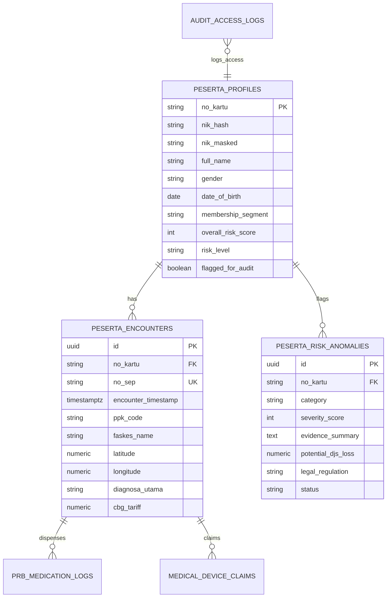

# INFERA: Database & Security Architecture Documentation
## Standar Kepatuhan UU No. 27/2022 (UU PDP) & Permenkes No. 16/2019

Dokumen ini mendokumentasikan spesifikasi model keamanan basis data, arsitektur *Row-Level Security* (RLS), enkripsi dan penyamaran NIK (*Dynamic Data Masking*), serta tata kelola jejak audit (*Audit Trail*) untuk platform **INFERA** dalam kategori lomba **"Efisiensi Risiko pada Peserta"** (Healthkathon BPJS 2026).

---

## 1. Prinsip Keamanan & Privasi Data Medis JKN

Sistem audit peserta BPJS Kesehatan mengelola data identitas kependudukan (NIK), riwayat diagnosa ICD-10 medis, serta lokasi fasilitas kesehatan yang tergolong sebagai **Data Pribadi yang Bersifat Spesifik** menurut **Pasal 4 ayat (2) UU No. 27 Tahun 2022 tentang Pelindungan Data Pribadi**.

INFERA mengimplementasikan 4 pilar arsitektur keamanan:
1. **Zero-Trust Role-Based Access Control (RBAC) via Supabase RLS**.
2. **Deterministic Cryptographic Hashing (SHA-256 / HMAC) & NIK Masking**.
3. **Mandatory Audit Logging (Pasal 35 UU PDP)** untuk setiap akses rekam transaksi peserta.
4. **Least-Privilege Execution** melalui PostgreSQL *Security Definer Functions*.

---

## 2. Struktur Tabel & Relasi Entitas



---

## 3. Matriks Hak Akses & Row-Level Security (RLS)

| Tabel | Role: `anon` (Tamu Publik) | Role: `authenticated` (Auditor Tim PK-JKN) | Role: `service_role` (Backend Engine) |
| :--- | :--- | :--- | :--- |
| `peserta_profiles` | **DIBLOKIR TOTAL** | Hanya peserta berstatus `flagged_for_audit = true` | Full CRUD |
| `peserta_encounters` | **DIBLOKIR TOTAL** | Read-Only (Hanya jika memiliki role `auditor`/`admin`) | Full CRUD |
| `prb_medication_logs` | **DIBLOKIR TOTAL** | Read-Only | Full CRUD |
| `medical_device_claims` | **DIBLOKIR TOTAL** | Read-Only | Full CRUD |
| `peserta_risk_anomalies`| Hanya via RPC Agregat | Read & Update Status Investigasi (`OPEN` $\to$ `RESOLVED`) | Full CRUD |
| `audit_access_logs` | **DIBLOKIR TOTAL** | Insert-Only (Otomatis saat membuka audit) | Full Read/Audit |

### Implementasi Kebijakan RLS Utama:
```sql
-- Blokir akses langsung anonim ke tabel profil
ALTER TABLE public.peserta_profiles ENABLE ROW LEVEL SECURITY;

-- Izinkan hanya backend service_role yang memiliki akses tulis
CREATE POLICY "service_role_manage_profiles" ON public.peserta_profiles
  FOR ALL TO service_role USING (true) WITH CHECK (true);

-- Izinkan auditor BPJS yang login untuk meninjau kasus anomali
CREATE POLICY "auditors_read_anomalies" ON public.peserta_risk_anomalies
  FOR SELECT TO authenticated
  USING (true);
```

---

## 4. Perlindungan Identitas & Penyamaran NIK

1. **Storage Level**: NIK mentah tidak pernah disimpan dalam plain text.
   - Kolom `nik_hash`: Dihasilkan menggunakan fungsi hash kriptografi bergaram (Salted SHA-256 / HMAC) untuk kebutuhan pencocokan identitas.
   - Kolom `nik_masked`: Disimpan dalam format sensor standar 16 digit: `3374**********01` (hanya 4 digit awal wilayah dan 2 digit akhir yang tampak).
2. **API Response**: Seluruh objek DTO (`PesertaProfile`, `ParticipantAuditCase`, `ParticipantRiskEvaluationResult`) hanya mengekspos properti `nikMasked`.

---

## 5. Kepatuhan Jejak Audit (Audit Trail — UU PDP Pasal 35)

Setiap investigasi atau penelusuran data peserta oleh verifikator dicatat dalam tabel `audit_access_logs`:
- ID Auditor (`accessed_by_user_id`)
- Tindakan (`action_performed`: e.g. `VIEW_PESERTA_TIMELINE`, `EXPORT_LEGAL_EVIDENCE`)
- Nomor Kartu Target (`target_no_kartu`)
- IP Address & User Agent
- Timestamp ISO-8601

Tabel ini berstatus *Append-Only* (tidak dapat diubah/dihapus oleh pengguna `authenticated`), menjamin integritas forensik hukum apabila kasus dilimpahkan ke aparat penegak hukum (APH / KPK / Kepolisian).
